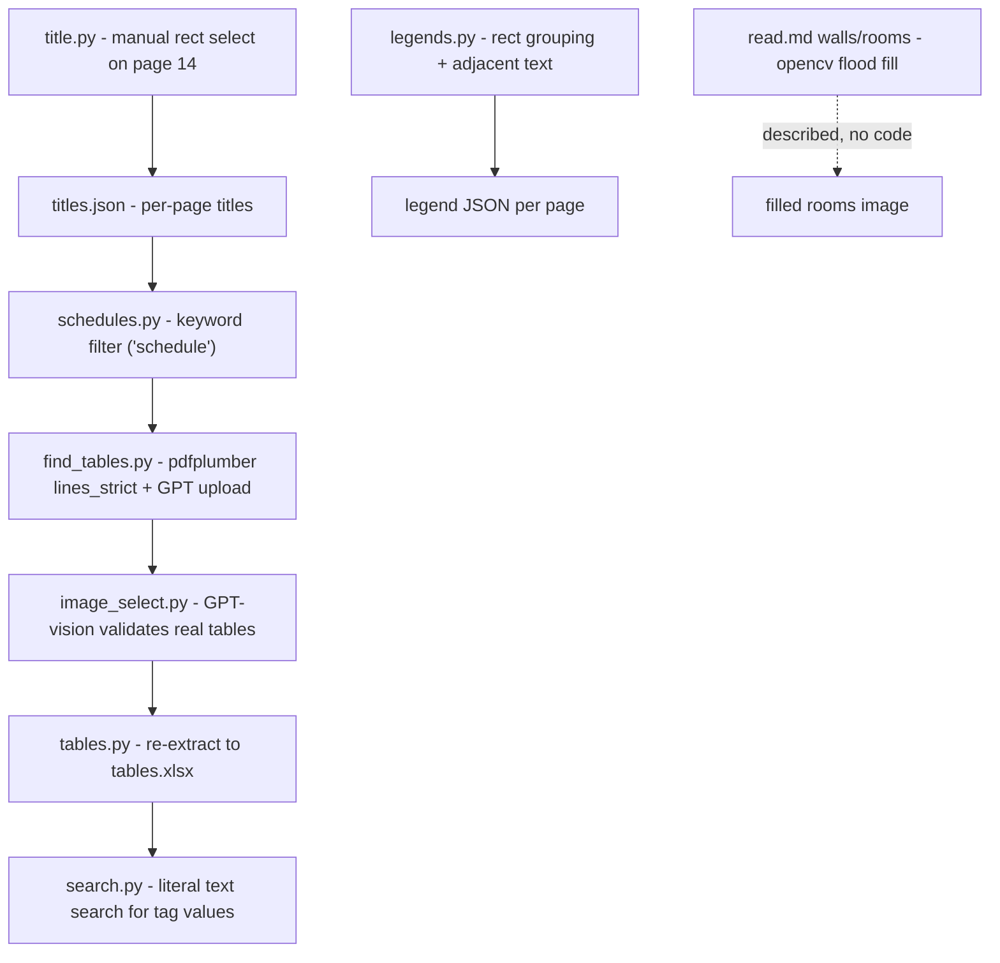
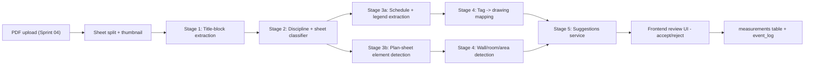

# AI Auto-Takeoff: Review and Productization Plan

This is an analysis and recommendation document, not an implementation plan. The deliverable is the assessment below; nothing under `AI/` or `backend/` will be modified until you sign off on a follow-up build plan.

---

## 1. What the Prototype Does Today



Pipeline stages identified, by file:

- [AI/controller/title.py](AI/controller/title.py) - matplotlib `RectangleSelector` on page 14, then PyMuPDF `get_text(clip=)` with Tesseract OCR fallback at 2x DPI for every page.
- [AI/controller/schedules.py](AI/controller/schedules.py) - filters `titles.json` for any title containing `schedule`.
- [AI/controller/find_tables.py](AI/controller/find_tables.py) - pdfplumber `find_tables({lines_strict})`, crops with 40px padding, uploads each crop to OpenAI Files (`purpose=vision`).
- [AI/controller/image_select.py](AI/controller/image_select.py) - GPT (`gpt-5.4-mini`) classifies which crops are real tables; saves `full_tables.json`.
- [AI/controller/tables.py](AI/controller/tables.py) - re-extracts validated tables into `tables.xlsx` (one sheet per table).
- [AI/controller/legends.py](AI/controller/legends.py) - rect rounding + size grouping + adjacent-text matching to find legend symbols (no template-match-back-to-plan yet).
- [AI/controller/search.py](AI/controller/search.py) - literal `text.lower().count()` search and `page.search_for` highlight.
- [AI/controller/reconstruct.py](AI/controller/reconstruct.py) - downloads a single OpenAI file by ID (manual probe).
- Walls/rooms logic from [AI/read.md](AI/read.md) is described but not implemented.

The choice of PyMuPDF + pdfplumber + OpenCV + Tesseract is right - same tools the Contruo backend already uses for plan processing.

---

## 2. Strengths Worth Keeping

- Right tool selection: PyMuPDF + pdfplumber matches `backend/app/services/plan_service.py` and `backend/app/tasks/pdf_processing.py`.
- Layered approach (title -> classify -> extract -> validate) is conceptually sound.
- Hybrid PDF-text + OCR fallback in `extract_text_from_rect` is the correct pattern.
- Using GPT vision as a *validator* (not primary extractor) for tables is good - cheap escalation pattern.
- Per-stage JSON artifacts make the pipeline debuggable.

---

## 3. Critical Gaps Blocking Productization

### 3a. Pipeline is not a service
- All scripts are CLI-driven, read `os.environ["Drawing"]`, and use relative `../data/{drawing}/` paths. Nothing is wired into FastAPI, Celery, Postgres, Supabase Storage, or `org_id` scoping.
- Hardcoded Windows paths in two places will break on a Linux Celery worker:

```16:16:AI/controller/title.py
pytesseract.pytesseract.tesseract_cmd = r"C:\Program Files\Tesseract-OCR\tesseract.exe"
```

- No idempotency. Re-runs reprocess everything; a single failed page kills the whole pass.
- No persistence model: results live in JSON files, not in DB tables that map back to `plan_sheets` / `measurements` / `event_log`.

### 3b. Outputs are not measurements
The product needs `measurements` rows tied to a `plan_sheet_id`, with vector geometry, condition assignment, and confidence. The prototype produces JSON listings of detected things with no link to the takeoff data model. The contract is wrong end-to-end.

### 3c. No scale awareness
Every detected element is in PDF user-units (1/72"). Scale calibration already exists in core takeoff (Sprint 06). Auto-takeoff must consume the project's calibrated `pixels-per-foot` (or per-meter) and emit world-units. Today the pipeline knows nothing about scale, so even a perfect wall detector would output meaningless quantities.

### 3d. Title-block detection is manual and brittle
[AI/controller/title.py](AI/controller/title.py) hardcodes page 14 and asks the user to draw a rectangle in matplotlib. Real users won't accept that. Also `select_region_on_page(doc[14])` will crash on PDFs with fewer than 15 pages.

### 3e. Sheet classification is too narrow
[AI/controller/schedules.py](AI/controller/schedules.py) only matches the keyword `schedule`. Misses:
- Floor plans, RCPs, power plans, plumbing plans, mechanical plans (where the *actual* takeoffs happen)
- Index/cover/specs (which we want to skip)
- Misnamed sheets (typos, abbreviations)

This is the crucial routing decision for the rest of the pipeline; it cannot be a single keyword.

### 3f. Tag -> drawing mapping is naive and double-counts
[AI/controller/search.py](AI/controller/search.py) uses `page.search_for(tag)` across *all* pages. That:
- Counts mentions on the schedule page itself (double counts).
- Counts mentions inside legends, notes, and revision blocks.
- Doesn't differentiate callout balloons from incidental string matches (e.g., room name `"A101"` vs door tag `"A101"`).
- Has no spatial output, so the user can't review what was matched.

### 3g. Legend detection has bugs and limited coverage
- Bug at [AI/controller/legends.py:112](AI/controller/legends.py): `im.draw_rects(list(rects))` references the for-loop variable `rects`, which holds whatever the last group iteration left behind (Python late binding inside a `defaultdict` group). Should be drawing the merged rectangles or all `rectangles`.
- Adjacent-text logic only looks to the *right* of the rect; legends often label below or above.
- Only handles rectangle-shaped swatches. Real legends use circles, hexagons, hatches, line samples.
- The "find this symbol everywhere on the drawing" half is not implemented yet, even though `read.md` describes it.
- Page is hardcoded (`pg = 50`).

### 3h. Walls/rooms strategy is the highest-risk gap
`read.md` proposes filling rooms with OpenCV after detecting walls from pdfplumber rectangles/lines. Two structural problems:
- Walls in vector PDFs are typically **two parallel polylines** representing wall thickness, not single rectangles. Pdfplumber's `rects` won't reliably surface them.
- Rasterizing then flood-filling loses sub-pixel precision unless DPI and scale are tracked carefully, and produces no editable vector geometry the user can refine.

This is the area that needs the biggest rethink (see section 5e).

### 3i. Operational issues
- Model name `gpt-5.4-mini` is suspect (likely a typo for `gpt-4o-mini` / current vision-capable model). All model IDs should come from a single config.
- GPT JSON parsing relies on `json.loads(output_text)` without `response_format={"type": "json_object"}` or structured outputs - one bad response kills the page.
- Every cropped image is uploaded to OpenAI per run; no content-hash caching means re-runs are expensive.
- No telemetry, no per-stage timing, no per-run cost tracking.

---

## 4. Recommended Productized Architecture

A staged Celery pipeline keyed by `(plan_id, sheet_id)`, with each stage's output cached in Postgres and surfaced live to the UI.



Key architectural decisions:

- **Each stage is an idempotent Celery task** writing to a new `ai_jobs` table with `(plan_id, sheet_id, stage, status, content_hash, output_json, confidence, cost_cents, created_at)`. Cache key is `sha256(file_bytes) + page_index + stage_name + model_version` - re-runs become free if inputs are unchanged.
- **Outputs land in a new `ai_suggestions` table**, not directly in `measurements`. Suggestions have `(suggestion_id, sheet_id, condition_id_guess, geometry_jsonb, confidence, status, source_stage)` and become real measurements only when the user clicks Accept (or bulk-accepts above a threshold). This gives us the "review and refine" UX promised in [features/ai/ai-auto-takeoff.md](features/ai/ai-auto-takeoff.md).
- **Scale-aware coordinates from day one.** Every suggestion stores both PDF coordinates and world-unit coordinates, computed from `plan_sheets.scale_px_per_unit`. If the sheet has no scale, the pipeline blocks at the discipline-classifier stage and prompts the user to calibrate first.
- **WebSocket/Liveblocks broadcast** of stage progress. Estimators see "12/47 sheets classified", "Door schedule extracted", "23 doors located" stream in. Reuses Liveblocks room-per-project (Sprint 13) instead of building a new socket.
- **`event_log` integration.** Every accept/reject/AI-write goes through `event_service.py` so the activity log shows "Sarah accepted 18 AI-detected doors on A-1.01".
- **Cost ledger.** Each Celery task records `cost_cents` and `tokens_used`. `billing_service.py` enforces per-org monthly caps and exposes usage in the billing dashboard.

---

## 5. Stage-by-Stage Redesign

### 5a. Title-block extraction

Replace the manual matplotlib selector with **auto-detection**:

- Heuristic: title blocks are dense clusters of small text in the bottom-right (US) or right-edge strip; group `page.get_text("words")` boxes by proximity, pick the largest cluster within 25% of the page edge.
- Validate: re-run the same bbox on 3-5 sample pages; if text-density and bbox stability look consistent, lock it as the project-wide title-block region.
- One-time review modal: show the auto-detected box on three random sheets; user clicks Confirm or drags to adjust. Saves a single `title_block_bbox` per `plan_id`.
- Use Tesseract only as fallback - if `get_text("text", clip=rect)` is empty, render at 2x and OCR. Same hybrid as today, just productized.

### 5b. Sheet classification

Replace the single keyword filter with a **dual-signal classifier**:

- **Lexical pass:** regex/keyword library per discipline (`A-` arch, `S-` struct, `M-` mech, `P-` plumbing, `E-` elec, `FP` fire protection) plus title keywords (`schedule`, `legend`, `floor plan`, `RCP`, `power plan`, etc.). Returns `{discipline, sheet_type, confidence}`.
- **Visual pass for low-confidence titles:** run a small vision call (GPT-4o-mini or a fine-tuned CLIP) on the page thumbnail when lexical confidence < 0.7. Cache by sheet hash so a 200-page set hits the model maybe 20 times.
- Output stored on `plan_sheets` as `discipline`, `sheet_type`, `classification_confidence`. Drives downstream pipeline routing - schedules pages -> stage 3a, plan pages -> stage 3b.

### 5c. Schedule + legend extraction

Schedules:
- Try multiple pdfplumber strategies in order (`lines`, `lines_strict`, `text`) and pick the result with most consistent row widths. Today only `lines_strict` is tried.
- For schedules without lines (whitespace-aligned): fall back to a Document-AI service (Azure Document Intelligence / AWS Textract) or GPT-4o vision with structured-output mode.
- **Schema inference per schedule type:** train small heuristics or prompts to identify the tag column (short alphanumeric, leftmost), description column, count column, dimensions column. Store as `schedule_columns` JSONB. This is the contract the tag-mapping stage consumes.
- Use OpenAI structured outputs (`response_format=json_schema`) instead of free-form JSON parsing.

Legends:
- Detect symbol shapes generically: rectangles + circles + polygons + hatch patches. Use OpenCV connected-components on a rasterized legend region after subtracting text.
- Allow labels above, below, left, or right of the symbol (today only right is checked).
- Crop each detected symbol as a **template image** stored in Supabase Storage, keyed by `(plan_id, legend_label)`.
- Fix the late-binding bug at [AI/controller/legends.py:112](AI/controller/legends.py).

### 5d. Tag -> drawing mapping (the actual count takeoff)

This is the highest-leverage feature; do it well:

- Use `page.get_text("words")` to get every word with bbox - much richer than `page.search_for`.
- For each schedule tag, search **only on plan-type sheets** (filtered by stage 5b classification) - never on schedule/legend/spec/index pages. Eliminates the double-count problem in [AI/controller/search.py](AI/controller/search.py).
- Disambiguate via spatial context: a tag inside a callout balloon (small circle/hexagon) is much more likely to be a real callout than a free-floating string. Detect bubble/leader geometry and weight matches accordingly.
- For non-text symbols (electrical outlets, plumbing fixtures): use template matching against the legend templates from 5c, then escalate ambiguous regions to a small object-detection model fine-tuned per legend (semi-supervised - the legend gives us labeled examples for free).
- Output: `ai_suggestions` rows with `geometry={point: {x_pdf, y_pdf, x_ft, y_ft}}`, `condition_id_guess` (matched to user's condition library by tag/description fuzzy match), and per-detection `confidence`.

### 5e. Wall, room, area detection

Replace the rectangle-flood-fill plan with vector-first detection:

- Extract page lines via `page.lines` (pdfplumber) or `page.get_drawings()` (PyMuPDF) - gives you actual line segments, not just rectangles.
- Cluster line segments into wall candidates: pairs of parallel polylines within 3-12 inches (in world units after scale calibration), running for a minimum length.
- Build a planar graph from the wall centerlines, find closed faces with Shapely - those are room polygons.
- Label each room by reading text strings whose bbox falls inside a face.
- Optional ML escalation: for hand-drawn or messy plans where vector heuristics fail, fall back to a U-Net or Segment-Anything-2 model on the rasterized page, then vectorize the masks.
- Output area suggestions with `geometry={polygon: [...]}`, area + perimeter precomputed in the calibrated unit.

### 5f. Suggestions and human-in-loop UI

- New endpoint `GET /api/v1/projects/{id}/ai/suggestions?sheet_id=&status=pending` returning grouped suggestions per condition.
- Frontend renders suggestions as ghosted overlays on the plan viewer with a side panel: "47 doors detected on A-1.01 (avg confidence 0.91) - [Accept all] [Review one by one]".
- Bulk-accept above a threshold (default 0.85), individual accept/reject below.
- Acceptance creates a real `measurements` row, marks suggestion `status=accepted`, writes `event_log` with `actor=user, source=ai`. Rejection just flips status; we keep the data for retraining.
- Re-run-aware: if the user re-runs auto-takeoff, accepted suggestions are preserved, only `pending` and `rejected` are recomputed.

---

## 6. New Capabilities Worth Adding

Beyond fixing what's there:

- **Confidence calibration UI.** Per-org tunable threshold for auto-acceptance. Estimating firms with high-trust workflows can crank it up; conservative shops keep it low.
- **Condition auto-mapping.** When a schedule is parsed, suggest a 1:1 mapping to existing conditions in the org's template library. Aligns with the org template library decision in `project-decisions.mdc`.
- **Plan revision diff (P2 hook).** Once the pipeline produces vector geometry per element, plan-revision diff (already a P2 feature) gets cheap - it's just polygon/point-set diffing across versions.
- **Cost meter on the billing dashboard.** Per-org auto-takeoff usage in `tokens_used` and `cost_cents`, exposed as a small panel and (optionally) used as a usage-billing meter via the `usage-based-billing` skill.
- **Re-training feedback loop.** Every reject is a labeled negative; every accept is a labeled positive. Store `(suggestion, geometry, user_decision)` tuples for future model fine-tuning. Even without retraining today, having the data is zero-regret.
- **Privacy mode toggle (future).** Even though OpenAI is fine for now, expose a per-org "redact-then-ask" flag that strips title block + project name before sending crops to the LLM. Cheap to add now, painful to retrofit later.

---

## 7. Suggested Phasing

A single Sprint can't cover all of this. Recommended P1 sequence (post-MVP, since auto-takeoff is P1 in [features/overview.md](features/overview.md)):

- **Phase A - Foundations (1 sprint):** New `ai_jobs` and `ai_suggestions` tables, Celery task scaffolding, `ai_service.py`, content-hash caching, cost ledger, model config in [backend/app/config.py](backend/app/config.py). No detection logic yet.
- **Phase B - Title block + classification (1 sprint):** Productize stages 5a and 5b. Auto-detect title block, classify every sheet, expose results in plan viewer. Even alone this is shippable - users get smart sheet index naming and discipline tags.
- **Phase C - Schedules + legends (1 sprint):** Stage 5c. End-to-end schedule extraction with structured outputs, legend symbol templates stored in Supabase Storage. Ship as "AI-extracted schedules" panel.
- **Phase D - Tag mapping (count takeoff, 1-2 sprints):** Stage 5d. The first stage that actually creates measurements. Ship as "Auto-count" feature for doors, fixtures, outlets.
- **Phase E - Walls and rooms (2 sprints):** Stage 5e. Hardest stage; benefits from B/C/D infrastructure. Ship as "Auto-area" feature.
- **Phase F - Plan revision diff (P2):** Reuses geometry pipeline from D and E.

---

## 8. Open Questions for You

These don't block the analysis but will shape the build plan:

- Pricing model for AI usage: included in seat price up to a quota, or pure usage-based? This decides whether we wire up the `usage-based-billing` Dodo flow now or later.
- Acceptable per-page processing time on a 200-sheet set? Drives whether we run heavy vision per page or only on flagged pages.
- Are we comfortable with a Document-AI vendor (Azure / AWS Textract) for table extraction, or strictly OpenAI? Document-AI is markedly better on lineless schedules.
- Frontend timing: do we ship Phase B/C as a free "plan understanding" feature for MVP marketing, or hold the entire AI bundle for a paid add-on?