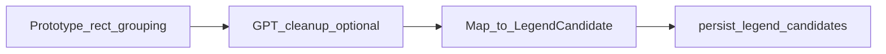

# Prototype legend detector + GPT cleanup (updated)

## Goal

Use the **same core algorithm as** [`AI/controller/legends.py`](AI/controller/legends.py) for keyword-matched legend sheets, then optionally run the **GPT false-positive filter** from that script (the block that was commented out in the prototype). Persist results with existing [`ai_legend_extractor`](backend/app/services/ai_legend_extractor.py) unchanged.

## Pipeline order (per legend sheet)

1. **Prototype detection** — `has_text_inside`, `get_adjacent_text` (right only), grouping, `merge_rects` → `merged_results` (`label` → `{x0,x1,top,bottom}`).

2. **GPT cleanup** — Filter `merged_results` to drop unlikely legend rows (gibberish / sentence-like labels / obvious non-legends), matching the prototype prompt intent. **If the LLM call fails or is disabled**, use unfiltered `merged_results` (same as today’s safe fallback pattern elsewhere).

3. **Map to `LegendCandidate`** — Convert pdfplumber boxes to `bbox_pdf` `{x0,y0,x1,y1}` with `y0=top`, `y1=bottom` for `fitz` clipping.

4. **Persist** — Unchanged extractor path.

## Implementation steps

### A. Prototype-only detector (unchanged from prior plan)

- Rewrite [`backend/app/services/ai_legend_detector.py`](backend/app/services/ai_legend_detector.py) to match the script; remove multi-direction scoring, max-size cap, confidence gating.
- Default `ai_legend_merge_tolerance` **2.0** in [`config.py`](backend/app/config.py).
- Bump [`SCHEDULES_LEGENDS_VERSION`](backend/app/tasks/ai_pipeline.py) to **`v2`** (or **`v3`** if GPT changes cache semantics — see below).

### B. GPT cleanup (new)

- **New helper** (e.g. `app/services/ai_legend_cleanup.py` or private functions in `ai_legend_detector.py`):

  - **Input:** JSON-serializable structure of the prototype output, e.g. list of `{ "label": str, "bbox": { "x0", "x1", "top", "bottom" } }` built from `merged_results`.

  - **Prompt:** Port the prototype’s user intent verbatim (analyze coordinates + label data, remove false positives, keep likely legend entries). Use **strict structured output** via existing `OpenAILLMModel.structured_output` (same pattern as [`ai_title_block.llm_extract`](backend/app/services/ai_title_block.py) / schedules LLM) so the model returns a **parsed list** of kept entries, not freeform prose.

  - **Factory:** New `get_legend_cleanup_llm()` in [`ai_models.py`](backend/app/services/ai_models.py) (or reuse `get_schedules_llm` if you want one less knob) with settings:

    - `ai_legend_cleanup_llm_provider` (default `openai`)

    - `ai_legend_cleanup_llm_model` (default `gpt-4o-mini`)

  - **Gating:** `ai_legend_cleanup_enabled: bool = True` — when `false`, skip LLM and use raw prototype output (cost-free debugging).

  - **Cost:** Wrap the call in `with_cost_tracking()` when `ai_run_id` / session context is available (follow existing model-call pattern in the pipeline).

  - **Failure:** On any exception or empty/invalid response, **log warning** and return the **unfiltered** prototype list.

- **Call site:** In `detect_legend_symbols` **after** building `merged_results` and **before** constructing `LegendCandidate` list — or in `_process_legend_sheet` immediately after `detect_legend_symbols` if you prefer to keep the detector pure (either is fine; prefer **inside detector** so cache serializes **post-cleanup** candidates and one cache entry reflects full pipeline).

- **Cache key interaction:** If cleanup is on, cached payloads should be for **post-cleanup** candidates. If you toggle `ai_legend_cleanup_enabled` or change cleanup model, bump **`SCHEDULES_LEGENDS_VERSION`** or include cleanup model id in the `legends_v1` `model_version` string in [`ai_pipeline.py`](backend/app/tasks/ai_pipeline.py) (e.g. `detector:v2|cleanup:gpt-4o-mini`) so cache hits are not wrong.

### C. Config + README

- Document new env vars in [`backend/README.md`](backend/README.md) (AI-03 section): `AI_LEGEND_CLEANUP_ENABLED`, provider/model for cleanup, and note cost implications.

### D. Tests

- Update [`test_ai_legend_detector.py`](backend/tests/unit/test_ai_legend_detector.py) per prior plan (remove above-only / huge-rect tests; adjust confidence assertions).

- **New unit tests** for cleanup: mock `OpenAILLMModel.structured_output` to return a filtered subset; assert dropped labels disappear; assert fallback on exception returns full prototype set.

## Out of scope

- Schedule extraction, keyword lists, UI.

## Risk note

Duplicate label strings still merge to one bbox in the prototype — unchanged.

---

## Todos

- [ ] Replace detector with prototype algorithm; map to `LegendCandidate`; wire GPT cleanup + fallbacks; include cleanup in cache `model_version`
- [ ] Config defaults + README for cleanup flags and LLM settings
- [ ] Bump `SCHEDULES_LEGENDS_VERSION` / detector version string for cache
- [ ] Update legend detector tests + add cleanup mock tests
- [ ] Dedupe any standalone debug dump module if it duplicates detector helpers
