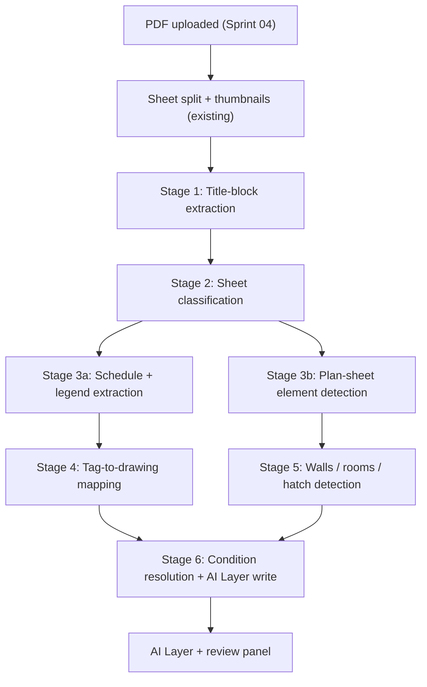

# AI Auto-Takeoff

> **Category:** AI Features
> **Priority:** P1 - Post-Launch
> **Status:** Deep-Dive Complete

## Overview

Automatically detect and measure elements from construction plans -- walls, rooms, finishes, doors, windows, fixtures, and equipment -- and turn them into real Contruo measurements grouped under the right conditions. The pipeline runs as background Celery jobs after a plan is uploaded and writes results into an "AI Layer" that the estimator can review, accept, edit, or reject. High-confidence detections are auto-promoted to real measurements; medium-confidence items wait for one-click review; low-confidence items are summarized and only revealed on demand.

The goal is not perfect zero-touch automation -- it is to remove 80% of manual tracing while keeping the estimator firmly in control. AI Auto-Takeoff depends on [AI Element Recognition](ai-element-recognition.md) for symbol/object detection and feeds [AI Quantity Suggestions](ai-quantity-suggestions.md) for assembly mapping.

## User Stories

- As an estimator, I want to upload a plan set and have the system automatically tag every sheet (discipline + sheet type) so I can find what I need without scrolling through 200 pages.
- As an estimator, I want the system to auto-detect the title block on the first sheet so I don't have to draw a region every time I start a project.
- As an estimator, I want walls and rooms detected automatically on architectural floor plans so I can skip the most tedious part of takeoff.
- As an estimator, I want hatch-fill regions matched to my legend so finish areas are measured without me tracing each one.
- As an estimator, I want door/window/equipment tags from schedules located on the plan and counted, so my counts are complete without manual marker placement.
- As an estimator, I want AI-detected measurements to use the conditions and assemblies my firm has already defined, so they slot into our existing pricing workflow.
- As an estimator, I want high-confidence detections to appear directly on the plan as real measurements, but lower-confidence ones to live in a review panel I can clear quickly.
- As an estimator, I want to bulk-accept or bulk-reject AI suggestions grouped by condition (e.g., "Accept all 47 walls") so I can clear the review queue in seconds.
- As an estimator, I want to re-run auto-takeoff after fixing a wrong scale or condition and have it update only the still-pending suggestions, not blow away my edits.
- As an estimator, I want the AI to never run twice on the same sheet at once, so my teammate and I don't fight over the same plan.
- As a project owner, I want a per-org cap on AI cost per month so a runaway plan set doesn't surprise us with a huge bill.

## Key Requirements

### Pipeline Stages

The auto-takeoff pipeline runs as a chain of idempotent Celery tasks keyed by `(plan_id, sheet_id, stage, content_hash)`. Stage outputs are cached so re-runs are free when inputs are unchanged.



### Stage 1: Title-Block Extraction

- **Auto-detect first.** Scan three randomly sampled sheets for the densest cluster of small structured text within 25% of any page edge (typical title-block location). Pick the most consistent bbox across samples. No user interaction unless detection confidence < 0.7.
- **Manual fallback only when needed.** If auto-detection is uncertain, the upload flow shows the detected box on a representative sheet and asks "Is this your title block?" with drag-to-correct. The corrected bbox is saved per `plan_id` and reused for every sheet.
- **Hybrid text extraction.** Try PyMuPDF `get_text("text", clip=rect)` first; fall back to Tesseract OCR at 2x DPI when no text is recovered.
- **Cleanup.** Strip line breaks, collapse whitespace, write per-sheet titles to `plan_sheets.title`.

### Stage 2: Sheet Classification

- **Lexical pass.** Match sheet number prefix (`A-`, `S-`, `M-`, `P-`, `E-`, `FP-`) and title keywords (`schedule`, `legend`, `floor plan`, `RCP`, `power plan`, `key plan`, etc.) to assign `discipline` (architectural, structural, mechanical, plumbing, electrical, fire-protection, civil) and `sheet_type` (cover, index, plan, schedule, legend, detail, spec, elevation, section).
- **Vision fallback.** When lexical confidence < 0.7, send the sheet thumbnail to a vision LLM with a fixed schema for `{discipline, sheet_type, confidence}`. Cache by sheet content hash so a 200-page set hits the model only on ambiguous pages.
- **Routing.** Schedule and legend sheets route to Stage 3a. Plan sheets route to Stage 3b. Index, cover, and spec sheets are skipped (still classified, just not measured).
- **Output.** New columns on `plan_sheets`: `discipline`, `sheet_type`, `classification_confidence`, `classification_method` (`lexical` | `vision`).

### Stage 3a: Schedule and Legend Extraction

- **Schedules.**
    - Try multiple pdfplumber strategies in order (`lines`, `lines_strict`, `text`); pick the result with the most consistent row widths.
    - Fall back to vision-based table extraction (Document AI or GPT vision with `response_format=json_schema`) for schedules without explicit lines.
    - **Tag-column identification (heuristic-first).** Score each column on:
        - Header keyword match (`MARK`, `TAG`, `NO.`, `NUMBER`, `ID`, `KEY`, `TYPE`, `SYMBOL`)
        - Value cardinality close to row count
        - Average value length <= 6 chars, alphanumeric
        - Column position (leftmost non-empty preferred)
    - LLM fallback only when the top-scoring columns are within 10% of each other or no column scores above threshold.
- **Legends.**
    - **Auto-detect** legend regions by finding clusters of small repeated shapes adjacent to short text labels (typical legend layout). Confidence-scored.
    - **Hybrid input.** When auto-detection confidence < 0.6 on a sheet, the user is prompted to draw a box around the legend region.
    - Detect symbol shapes generically: rectangles, circles, polygons, hatch swatches. Allow labels above, below, left, or right of the symbol.
    - Crop each detected symbol as a **template image** stored in Supabase Storage at `legends/{plan_id}/{legend_label}.png`, keyed by `(plan_id, legend_label)`.
- **Output.** Per-table `extracted_schedules` rows and per-symbol `extracted_legends` rows linked to the sheet they came from.

### Stage 3b: Plan-Sheet Element Detection

- For sheets classified as plans, run element detection per element type (walls, rooms, hatches, symbols). Implementation details for each element type live in [AI Element Recognition](ai-element-recognition.md).
- Results are not measurements yet -- they are geometric primitives in PDF user space (points, polylines, polygons) ready for Stage 6.

### Stage 4: Tag-to-Drawing Mapping

- For every tag value identified by Stage 3a, locate it on the **plan sheets only** (skip schedule, legend, spec, and index pages -- this fixes the prototype's double-counting bug).
- Use `page.get_text("words")` for exact word bboxes; literal `search_for` is used only for confirmation.
- Disambiguate via spatial context: tags inside callout balloons (small circle/hexagon shapes) score higher than free-floating text. Detect bubble/leader geometry and weight matches.
- For non-text symbols (electrical outlets, plumbing fixtures), use template matching against the legend templates from Stage 3a (multi-scale, rotation-tolerant via OpenCV).
- **Output.** Each match becomes a candidate count measurement with `(sheet_id, x_pdf, y_pdf, tag_value, confidence, source_legend_id)`.

### Stage 5: Walls, Rooms, and Hatch Detection

#### Walls

- **Vector-first.** Use PyMuPDF `page.get_drawings()` to get true paths (lines + curves), not just bboxes. Cluster line segments by direction; for each direction bucket, find pairs of near-parallel segments separated by typical wall thickness in **world units** (using sheet calibration: 4"-12" interior, 6"-16" exterior).
- **Centerline construction.** Midline of each parallel pair = wall centerline. Snap endpoints together where centerlines meet to build a clean wall graph.
- **Opening detection.** Door swings (small arcs near wall ends) mark openings. Window break-marks (parallel short ticks across a wall) also mark openings. Openings split walls in the graph and prevent room leakage downstream.
- **Raster fallback.** When vector extraction yields too few lines (scanned plans, image-only PDFs), rasterize at adaptive DPI, run a U-Net or SAM2 segmentation model, then vectorize the wall mask with `cv2.findContours` + `approxPolyDP`. Back-map to PDF user space using the pixmap scale.

#### Rooms

- **Planar-graph faces.** Run Shapely `polygonize` on the wall centerline graph (with openings closed for room detection only). Each enclosed face = a room polygon.
- **Room labeling.** Read text strings whose centroid falls inside a face -- becomes the room label and seeds `measurement.label`. Faces with no interior text are flagged low-confidence.
- **Raster flood-fill fallback.** When the planar-graph approach yields too few rooms (typically because of dashed walls or scanned plans), draw walls onto a binary mask, invert, run `cv2.connectedComponentsWithStats`, vectorize each component contour, and back-map to PDF user space. Filter out the page background and tiny noise components.

#### Hatch / Finish Regions

- Detect hatch-fill regions separately from rooms. Hatches may cover part of a room, multiple rooms, or non-room areas (parking, paving).
- **Vector path.** When the PDF has explicit hatch patterns as vector geometry, extract them via `page.get_drawings()` and group by stroke/fill style.
- **Raster path.** When hatches only exist as repeated raster patterns, segment the page by texture (`cv2.matchTemplate` against legend swatches at multiple scales) and vectorize the resulting masks.
- **Match to legend.** OpenCV multi-scale, rotation-tolerant template matching against the legend templates from Stage 3a returns `(legend_label, confidence)` per region.
- **Outer polygon only** for v1 (no hole/cutout detection).
- **Overlapping hatches split into separate regions** -- never overlay or stack.

### Stage 6: Condition Resolution and AI Layer Write

- For every detected element (count, wall, room, hatch), resolve the right `Condition` using **Match -> Template -> Create**:
    1. **Match.** Fuzzy-match by name, measurement_type, and unit against existing project Conditions. Threshold 0.85 cosine on name embeddings + exact match on measurement_type.
    2. **Template.** If no project match, fuzzy-match against the org's `condition_templates`. If found, **clone** the template into the project (preserves styling and assembly_items) and use the new project Condition.
    3. **Create.** If neither matches, create a raw project Condition. Name from schedule/legend description (LLM-summarized to a short, consistent name like "6'-0" Single Door"). Unit from the project's unit system (imperial -> SF/LF, metric -> m2/m). Default styling per measurement_type.
    - **UX nudge.** When a raw condition is created, the next time the user views it the panel shows: "This condition was created by AI. Save to your team library?" -- pushing template growth without forcing it.
- **Geometry coordinates.** All AI geometry is stored in **PDF points** (the same coordinate system the rest of the backend uses; see `backend/app/utils/measurement_quantity.py`).
- **AI Layer write.** Detected elements are written to a new `ai_layer_items` table (not `measurements`) with `(id, ai_run_id, sheet_id, condition_id, measurement_type, geometry, confidence, source_stage, status)`. Status starts as `pending`.

### AI Layer and Review UX

#### Confidence-Tiered Behavior

- **High confidence (>= 0.9):** auto-accepted on write. Creates a real `Measurement` row immediately. AI Layer item status -> `accepted_auto`. Real measurement is tagged with `source = ai`, `ai_run_id` for provenance.
- **Medium confidence (0.6 - 0.9):** lives in the AI Layer as `pending`. Visible on the plan at 50% opacity in the condition's color. Listed in the review panel.
- **Low confidence (< 0.6):** hidden by default. The review panel shows a digest banner: "23 low-confidence items hidden -- expand to review."
- **Thresholds are configurable per project.** Default `auto_accept_threshold = 0.9`, `hide_threshold = 0.6`. Estimating firms with high-trust workflows can lower auto-accept; conservative shops can raise it.

#### Handling a Heavy Low-Confidence Bucket

A run that dumps a large number of items into the low-confidence bucket usually means something upstream is wrong (scale not calibrated, wrong sheet classification, unfamiliar legend). The system handles this in three ways:

- **Run health summary.** After every run, the AI Layer panel shows: `"AI Run completed: 47 auto-accepted, 12 to review, 23 low-confidence hidden. Median confidence: 0.84."` If the low-confidence count exceeds 30% of total detections, a banner suggests likely causes (uncalibrated scale, unmatched legends).
- **One-click expansion.** "Show all low-confidence items" expands them into the review panel without changing thresholds.
- **Adaptive threshold per condition.** Over many runs we track the per-condition confidence distribution. If a condition's median confidence is consistently low, the auto-accept threshold for that condition tightens automatically and the user is informed.
- **Quality investment.** The detection algorithms in Stage 5 (especially walls and hatches) are tuned with heuristics-first to keep medium-confidence the dominant bucket and low-confidence the exception. Vision/LLM escalation happens only when heuristics are ambiguous, both controlling cost and avoiding the common failure mode where models guess and produce a flood of low-confidence noise.

#### Review Panel

- **Grouped by Condition.** "Walls -- 47 detected, 12 pending review", expandable. Each group has bulk actions: Accept all, Reject all, Accept above 0.8.
- **Per-item actions.** Accept (creates measurement), Reject (marks `rejected`), Edit (opens the normal vertex/polygon editor; on save, accepts and creates measurement).
- **Per-sheet, on-demand rendering.** AI Layer overlays only render on the sheet the user is currently viewing. Aggregate counts per sheet are shown in the sidebar.
- **Quiet UI.** AI Layer geometry at 50% opacity. Condition color preserved so the visual mapping stays consistent with real measurements.
- **Keyboard shortcuts.** `A` accept, `R` reject, `E` edit, `Tab` next, `Shift+Tab` previous.

### Wall Geometry Storage

A wall is **one** measurement row, not two. The geometry payload carries the centerline plus enough information to derive outer and inner edges on demand:

```json
{
  "type": "linear",
  "vertices": [...],            // canonical centerline (drives measured_value)
  "wall_thickness_pdf": 6.0,    // single float
  "alt_paths": {                // optional, only for non-derivable cases
    "outer": [...],
    "inner": [...]
  }
}
```

- **Straight wall segments:** `outer` and `inner` are computed on demand by offsetting the centerline by ±thickness/2 along its perpendicular. No extra storage.
- **Curved/arc walls or non-uniform thickness:** explicit `alt_paths.outer` / `alt_paths.inner` are stored. Rare but supported.
- **Display toggle in the viewer:** Centerline (default) | Outer | Inner. The toggle is a UI preference per project; it does not change the stored measurement or the `measured_value`.
- **Derived quantities** in assemblies can reference both lengths via formula variables (`length`, `length_outer`, `length_inner`, `thickness`) so a single wall measurement still drives drywall (centerline) and sealant (outer) without duplicating rows.

### Re-Run Behavior

- **Per-sheet AI lock.** A new `ai_runs` row with `status = running` blocks any new run on the same `(plan_id, sheet_id)` until it finishes or fails. This prevents two estimators from triggering parallel runs on the same sheet.
- **Pending-item replacement.** A re-run replaces existing AI Layer items still in `pending` status for the same sheet. New items inherit higher-confidence detections from the new run.
- **Accepted measurements are sacred.** AI-created measurements that were accepted (whether auto or user) are **never overwritten**. If a re-run would have produced a different geometry for the same element, it is logged as a divergence and surfaced in the run summary -- not silently changed.
- **Rejected items are remembered.** Re-runs do not re-suggest items the user previously rejected on the same sheet (deduped by spatial proximity + condition).

### Provenance and Bulk Operations

New fields on `measurements`:

- `source` -- `'user'` (default) or `'ai'`.
- `ai_run_id` -- nullable FK to `ai_runs`. Set for any measurement created from an AI Layer accept.

New table `ai_runs`:

- `id`, `plan_id`, `triggered_by` (user_id), `status` (`queued`, `running`, `completed`, `failed`, `cancelled`)
- `model_version`, `started_at`, `finished_at`
- `cost_cents`, `tokens_used`, `items_total`, `items_accepted_auto`, `items_pending`, `items_low_confidence`
- `summary_jsonb` -- per-stage timings, per-condition counts, divergences

This enables:

- "Show me everything created by Run #7" filter in the quantities panel.
- Bulk delete of a single run's results (undo a bad run cleanly).
- Per-run export for QC.
- Run-quality dashboards.

### Real-Time Collaboration Integration

- AI writes flow through the **same measurement-broadcast path** that Liveblocks already uses, so other users in the project see overlays and accepted measurements appear live.
- Run progress (`Stage 2 complete: 142/200 sheets classified`) is broadcast as a presence update, visible in the project header.
- The AI lock is exposed as a presence flag so other users see "Sarah is running auto-takeoff on this plan" instead of being able to retrigger.

### Cost and Throttling

- Every Celery task records `cost_cents` and `tokens_used` to the parent `ai_runs` row.
- Per-org monthly cost ceiling configurable in org settings (default: TBD per pricing model).
- Runs auto-pause at the cap and surface a banner; org admins can raise the cap or wait until the next billing cycle.
- Per-stage caching by content hash means re-running on the same plan set is effectively free for unchanged sheets.

## Nice-to-Have

- **Review Queue mode** -- a Gmail-style linear walkthrough that pans/zooms to each pending item and shows `Accept | Reject | Edit | Skip`. Deferred until the rest of the AI Auto-Takeoff flow is shipped and stable.
- **Confidence calibration UI** -- per-condition threshold tuner with a histogram of past detection confidences.
- **Sheet-set diff** -- when a revised plan set is uploaded, AI compares vs the previous run and surfaces only the deltas (precursor to AI Plan Comparison).
- **Active-learning loop** -- store every accept/reject decision tied to the geometry that was suggested. Feed into model fine-tuning over time.
- **Per-discipline run priority** -- estimators specializing in a trade can prioritize MEP sheets or Architectural sheets first.
- **AI explainability popover** -- "Why did the AI suggest this?" -> "Matched legend swatch 'CARPET-01' with 0.87 confidence at this location."
- **Privacy mode toggle** -- redact title block + project name from any image sent to a third-party LLM. Cheap to add now, painful to retrofit.

## Competitive Landscape

| Competitor | How They Handle It |
|------------|--------------------|
| PlanSwift | No AI auto-takeoff. Entirely manual measurement. Some symbol counting via image template matching, but the user must define the template per session. Desktop-only. |
| Bluebeam | No automated takeoff. Markup-style measurement annotations only. Recent "Automation" features focus on form recognition, not construction takeoff. |
| On-Screen Takeoff | Limited symbol-counting automation via OCR and image matching. No automatic wall/room/finish detection. Desktop-only. |
| Togal.AI | The strongest competitor here. Focuses on auto-detecting walls, rooms, and finishes from architectural plans. Outputs measurements directly to their own takeoff database. Limited to architectural; weak on MEP/structural. Does not integrate with org-defined conditions and assemblies. |

Contruo's edge: AI Auto-Takeoff produces measurements that **inherit your firm's conditions and assemblies**, runs **across all disciplines** (not just architectural), and lives inside a **real-time collaborative** plan viewer. Combined with the AI Layer review pattern, it is the first auto-takeoff that an estimating manager can trust enough to deploy to a junior estimator.

## Open Questions

- [ ] What is the default per-org monthly AI cost ceiling? Tied to subscription pricing decisions.
- [ ] Should low-confidence items still write to `ai_layer_items` (counted but hidden) or be discarded entirely below a hard floor (e.g., < 0.3)?
- [ ] What is the policy when the user uploads a plan revision -- run AI Auto-Takeoff automatically on the new version, or require manual trigger?
- [ ] How do we handle multi-page schedules (e.g., Door Schedule continued across 3 sheets)? Stitch first, then extract?
- [ ] Should the org be able to designate "blessed" `ConditionTemplates` (hand-curated, AI-preferred) vs auto-saved templates?
- [ ] Does the AI Layer count toward seat-based collaboration limits? (Probably no -- it is a system-generated state.)
- [ ] How should AI handle sheet-set hierarchies where a single PDF contains multiple plan stamps (e.g., key plan + enlarged plan on the same sheet)?

## Technical Considerations

- **Celery task DAG** with per-stage idempotency keyed by `(plan_id, sheet_id, stage, content_hash, model_version)`. A new Celery queue (`celery_app.py`) for AI tasks isolates them from the existing PDF-processing and export workers.
- **PostgreSQL changes:**
    - New tables: `ai_runs`, `ai_layer_items`, `extracted_schedules`, `extracted_legends`.
    - New columns on `measurements`: `source`, `ai_run_id`.
    - New columns on `plan_sheets`: `discipline`, `sheet_type`, `classification_confidence`, `classification_method`.
    - `org_id` on every new table for RLS multi-tenancy (matches existing pattern).
- **Coordinate system.** All AI geometry stored in PDF user space points so existing `measurement_quantity.py` math works without translation.
- **Rasterization.** Standardize on PyMuPDF `page.get_pixmap()` for both rendering and back-mapping to keep the conversion math consistent. Adaptive DPI (target 200, max 300) to bound memory.
- **Vision model selection.** Configurable in `backend/app/config.py` -- single `AI_VISION_MODEL` env var rather than hardcoded model names per script. Default to a current GPT-4o-class vision model.
- **Liveblocks broadcast.** Reuse the existing measurement sync channel for AI-created measurements. Add a new presence event for AI run progress.
- **Cost telemetry.** Wrap every external model call in a small helper that records `cost_cents` and `tokens_used` to the active `ai_runs` row.
- **Per-sheet AI lock** implemented as a Postgres advisory lock keyed by `hash(plan_id, sheet_id)` plus an `ai_runs.status` check.
- **Caching.** Stage outputs cached by `(content_hash, stage, model_version)` in a separate `ai_stage_cache` table or as a JSONB blob on `ai_layer_items`. Re-runs on unchanged sheets skip stages whose inputs are unchanged.
- **Heuristics-first discipline.** Every stage that calls an LLM/vision model must have a deterministic heuristic that resolves the easy cases first. The model is the fallback, not the default. This is the single biggest cost and reliability lever in the system.

## Notes

- AI Auto-Takeoff is the highest-leverage P1 feature in the roadmap. Expect ~3 sprints to deliver Stages 1-2 (foundations + classification), 1-2 sprints for Stages 3-4 (schedules + tag mapping), and 2 sprints for Stage 5 (walls/rooms/hatches). The AI Layer UI work overlaps with all of them.
- The walls/rooms approach in `AI/controller/walls_rooms.py` (rect-based wall detection + raster flood-fill) is a useful prototype for understanding the problem but is being replaced by the vector-first algorithm described in Stage 5. The raster path is preserved as the fallback for scanned plans.
- The "Match -> Template -> Create" condition resolution is what differentiates Contruo's auto-takeoff from competitors. Without it, AI generates noise that ignores firm standards. With it, AI feels like an extension of the team's existing workflow.
- Storing wall geometry as one row with a derived outer/inner is a deliberate tradeoff: minimal DB egress, single broadcast, single derived-quantity computation. The display toggle gives users the visual flexibility they need without the data-model cost.
