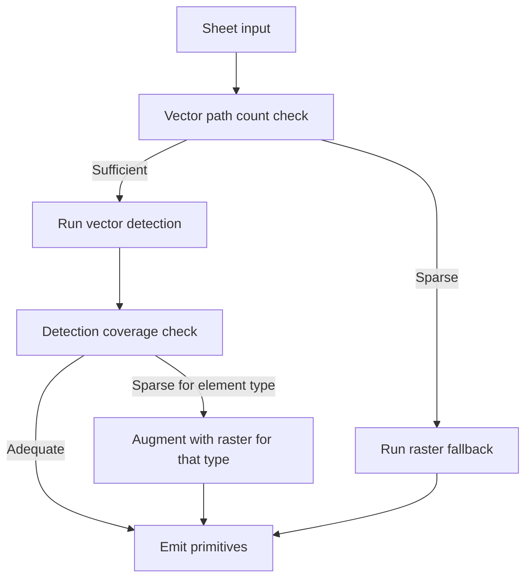

# AI Element Recognition

> **Category:** AI Features
> **Priority:** P1 - Post-Launch
> **Status:** Deep-Dive Complete

## Overview

Identify and classify construction elements from plan sheets -- walls, rooms, doors, windows, fixtures, MEP components, hatch fills, callout balloons, and structural elements -- using a hybrid of vector-geometry analysis, OpenCV template matching, and vision models. Element Recognition is the perception layer that powers [AI Auto-Takeoff](ai-auto-takeoff.md): it produces geometric primitives (points, polylines, polygons) and metadata (label, source legend, confidence) that the auto-takeoff pipeline then maps to conditions and writes to the AI Layer.

The design principle is **heuristic-first, model-fallback** at every stage. Deterministic vector and template-matching code resolves the easy 80% of cases. Vision/LLM calls are reserved for ambiguous regions and unusual sheets, both to control cost and to avoid the failure mode where a model floods the system with low-confidence guesses.

## User Stories

- As an estimator, I want the system to recognize walls on architectural plans so I don't have to trace them manually.
- As an estimator, I want my legend symbols (electrical outlets, plumbing fixtures, etc.) detected wherever they appear on the plan so I get accurate counts.
- As an estimator, I want hatch fills (carpet, tile, concrete) recognized and matched to my legend so finish areas are measured automatically.
- As an estimator, I want callout balloons (door tags, equipment tags) detected and linked back to my schedule rows so my counts tie to the right specs.
- As an estimator, I want recognition to work on both clean vector PDFs and scanned/image-only PDFs so I'm not stuck when the architect sends a scan.
- As an estimator, I want the recognition system to tell me when it's unsure (with a confidence score) so I know which detections to spot-check.
- As an estimator working on MEP plans, I want fixtures recognized even when they overlap with floor plan linework so my MEP counts aren't lost in the noise.

## Key Requirements

### Element Types Supported (v1)

| Element Type | Output Geometry | Detection Method (Primary) | Detection Method (Fallback) |
|--------------|-----------------|---------------------------|-----------------------------|
| **Walls** | Polyline (centerline) + thickness | Vector parallel-pair clustering | Raster segmentation (U-Net / SAM2) + vectorize |
| **Rooms** | Polygon | Planar-graph faces from wall centerlines | Raster flood-fill of inverted wall mask |
| **Hatch / Finish regions** | Polygon | Vector path grouping by fill style | Texture template matching against legend swatches |
| **Symbols (fixtures, equipment)** | Point + bounding box | OpenCV template matching against legend symbols | Vision model fallback for unmatched candidates |
| **Callout balloons** | Point + tag text | Shape detection (small circle/hexagon) + interior word extraction | Vision model fallback |
| **Door swings** | Arc + endpoint anchors | Vector arc detection near wall endpoints | Skipped in raster fallback |
| **Window break-marks** | Short tick pairs across walls | Vector pattern detection | Skipped in raster fallback |
| **Text labels (room names, tags)** | Word bbox + string | PyMuPDF `get_text("words")` | Tesseract OCR at 2x DPI |

### Detection Approach

#### Vector-First (Primary)

For PDFs with usable vector content, recognition runs against the parsed PDF geometry:

- **PyMuPDF `page.get_drawings()`** returns true paths (lines, curves, fills) with stroke and fill metadata. This is the highest-fidelity input.
- **pdfplumber `page.lines`, `page.rects`, `page.curves`** complements PyMuPDF for table-like layouts and gives word-level text bboxes.
- Vector geometry is processed in **PDF user space points**, the same coordinate system the rest of the backend uses (see `backend/app/utils/measurement_quantity.py`).
- All clustering, parallelism detection, and shape filtering happens with **world units** after applying the sheet's calibrated scale, so thresholds (e.g., "wall thickness 4-12 inches") are meaningful regardless of the PDF's intrinsic DPI.

#### Raster Fallback

When vector extraction yields fewer than a configurable threshold of paths per sheet (typical for scanned plans or image-only PDFs), recognition falls back to raster:

- Render the page at adaptive DPI via PyMuPDF `page.get_pixmap()` (target 200, max 300).
- Run the appropriate model (U-Net for walls, SAM2 for general segmentation, template matching for symbols).
- **Vectorize masks** with `cv2.findContours` + `approxPolyDP` and back-map pixel coordinates to PDF user space using the pixmap scale.
- The raster path skips finer-grained detections (door swings, window break-marks) that depend on vector precision.

#### Hybrid Decision Logic

For each sheet, recognition automatically selects the best detection method per element type:

### Wall Detection (Vector)

- **Path extraction.** PyMuPDF `get_drawings()` -> all `l` (line) and `c` (curve) segments with stroke style.
- **Direction bucketing.** Snap each segment's angle to nearest 5°. Group into direction buckets.
- **Parallel-pair clustering.** Within each direction bucket, find pairs of segments that:
    - Are roughly the same length (±20%)
    - Are separated by a perpendicular distance in the wall-thickness range (4-16 inches in world units, configurable)
    - Overlap along their shared direction (>50% overlap)
- **Centerline construction.** Midline of each pair = wall centerline. Endpoint snapping (within 6" world units) joins centerlines into a wall graph.
- **Validation.** A wall candidate is kept if it has at least one orthogonal connection (corner, T-intersection) or door swing nearby. Isolated short pairs are filtered as noise.
- **Output:** list of `(wall_id, centerline_polyline, thickness_pdf, confidence)`.

### Room Detection

- **Planar-graph faces.** From the wall centerline graph, run Shapely `polygonize` (with door openings and window openings closed for the room-detection pass only).
- **Face filtering:** drop faces below minimum room area (default 25 sq ft), drop the page-bounding face.
- **Room labeling.** For each face, find text strings whose centroid falls inside the polygon. The longest matching string becomes the room name.
- **Confidence.** Faces with interior text labels score higher than unlabeled faces.
- **Output:** list of `(room_id, polygon, label, confidence)`.

### Hatch / Finish Region Detection

- **Vector hatch paths.** Group `page.get_drawings()` items by `(fill, stroke, dash)` style. Adjacent groups become candidate hatch regions.
- **Raster texture matching.** When hatches only exist as repeated raster patterns:
    - For each legend swatch from Stage 3a of [AI Auto-Takeoff](ai-auto-takeoff.md), compute multi-scale templates.
    - Slide-match against the page raster using `cv2.matchTemplate` with normalized cross-correlation.
    - Threshold the response map to get a binary mask per legend swatch.
    - Vectorize the mask into polygons.
- **Region polygons:** outer boundary only for v1 (no hole/cutout detection).
- **Overlap policy:** when two different hatch patterns claim the same area, **split** the overlap into separate regions for each pattern (never overlay).
- **Output:** list of `(hatch_region_id, polygon, matched_legend_label, confidence)`.

### Symbol Detection

- **Legend templates first.** Use the legend templates extracted in Stage 3a of [AI Auto-Takeoff](ai-auto-takeoff.md) as the template library. Each plan set has its own templates so we automatically adapt to firm-specific symbol styles.
- **Multi-scale, rotation-tolerant matching.** OpenCV `matchTemplate` at scales 0.7x-1.3x in 0.1x increments and rotations 0°/90°/180°/270°. Aggregate the response maps and threshold.
- **Non-maximum suppression** to dedupe overlapping detections.
- **LLM/vision fallback** only for sheet regions with high "symbol-like density" but no template match -- prevents wasted vision calls on plain plan areas.
- **Output:** list of `(symbol_id, position_pdf, bbox_pdf, matched_legend_label, confidence)`.

### Callout Balloon Detection

- Detect small circles, hexagons, and clouds that contain a short alphanumeric string. These are callout balloons (door tags, equipment tags, room finish keys).
- **Vector path:** look for closed paths with bounding box < 1 inch in world units containing exactly one short text string.
- **Raster fallback:** Hough circle/contour detection + OCR.
- Match the interior text against schedule tag values from Stage 3a -> the balloon becomes a counted instance of that tag.
- **Output:** list of `(balloon_id, position_pdf, tag_value, matched_schedule_id, confidence)`.

### Coordinate System and Output Contract

- **All geometry returned in PDF user space points** so [AI Auto-Takeoff](ai-auto-takeoff.md)'s Stage 6 can write directly to `ai_layer_items` without coordinate translation.
- Each primitive carries `confidence` in `[0.0, 1.0]`, `source_method` (`vector` | `raster` | `vision`), and `source_inputs` (e.g., `legend_id` for symbols/hatches, `template_hash` for cached models).

### Caching and Idempotency

- Recognition output is cached per `(sheet_id, element_type, content_hash, model_version)` so re-runs are free when nothing changed.
- Cache invalidation when:
    - Sheet bytes change (revision uploaded)
    - Sheet scale calibration changes
    - Legend templates change (new legend extraction in Stage 3a)
    - Detection model version changes

## Nice-to-Have

- **Active-learning loop.** Every accept/reject from the AI Layer becomes a labeled example for fine-tuning the detection models.
- **Custom symbol training.** Per-org or per-project ability to upload a few examples of an unusual symbol and have the system recognize them across the plan set.
- **Detection explainability.** Per-detection metadata that the UI can use to render "Why?" -- e.g., "Matched legend swatch CARPET-01 with 0.87 NCC at this location."
- **Cross-sheet element correlation.** Detect when the same element (e.g., a piece of equipment) appears on multiple sheets and link them.
- **Confidence calibration dashboard.** Per-element-type confidence distributions over time to spot drift in detection quality.
- **Slope/elevation awareness.** When elevation/section views are detected, infer height/depth metadata to feed volume takeoff (currently P1 backlog).

## Competitive Landscape

| Competitor | How They Handle It |
|------------|--------------------|
| PlanSwift | Manual symbol counting via image template matching, defined per session by the user. No automated recognition of walls, rooms, or finishes. |
| Bluebeam | Recent visual search and form-recognition features focus on document automation, not construction element recognition. |
| On-Screen Takeoff | Symbol counting via OCR and image matching. Limited to one symbol type per pass. No wall/room/finish recognition. |
| Togal.AI | Strongest competitor in element recognition for architectural plans (walls, rooms, finishes). Built on a custom vision model. Limited coverage for MEP and structural disciplines. |

Contruo's edge: a **hybrid recognition stack** that combines deterministic vector analysis (cheap, fast, accurate where the data supports it) with model-based fallbacks for the harder cases, instead of pushing every page through a vision model. This keeps cost and latency in check while extending coverage to MEP and structural disciplines that pure-vision tools struggle with.

## Open Questions

- [ ] Which vision model is the right default for raster fallbacks -- a hosted vendor (GPT-4o, Claude Sonnet) or a self-hosted model (SAM2, Florence-2)?
- [ ] Where should the line be drawn between "vector recognition coverage adequate" and "augment with raster"? Per element type or per sheet?
- [ ] How do we handle plans with mixed clean vector and embedded raster (e.g., scanned title block, vector drawing area)?
- [ ] Should custom symbol training (per-project) be a v1 capability or deferred?
- [ ] How are detection model versions surfaced to users? (Just for run reproducibility, or also for opt-in beta of new models?)
- [ ] What is the right minimum room area filter -- absolute (e.g., 25 sq ft) or relative to total plan area?

## Technical Considerations

- **PyMuPDF + pdfplumber + Shapely + OpenCV** as the deterministic stack. All already used elsewhere in the backend.
- **scipy.spatial.KDTree** for endpoint snapping and parallel-pair clustering. Avoid the O(N²) pattern from `AI/controller/walls_rooms.py`; use spatial indexing throughout.
- **Coordinate hygiene.** Every geometry primitive is tagged with its coordinate system (`pdf_pts`) at construction. No mixed-unit math.
- **Adaptive DPI.** Rasterize at the lowest DPI that preserves the smallest feature of interest (typically 200 DPI for symbols, 300 DPI for fine hatch). Bounded by a per-sheet max.
- **Memory management.** Process pages one at a time in Celery tasks. Page rasters are released between stages.
- **Model abstraction.** A thin `RecognitionModel` interface so vision models (vendor or self-hosted) are swappable per element type without changing the pipeline.
- **Reproducibility.** Each run records `model_version` and the `template_hash` set used, so a re-run on the same inputs is bit-identical (within model determinism).
- **No global Tesseract path.** Replace the hardcoded `pytesseract.pytesseract.tesseract_cmd = r"C:\Program Files\Tesseract-OCR\tesseract.exe"` from the prototype with an env var fallback so it works in a Linux Celery worker.

## Notes

- This feature is the perception layer; it does not write measurements directly. The handoff to [AI Auto-Takeoff](ai-auto-takeoff.md) Stage 6 (condition resolution + AI Layer write) is where geometric primitives become user-visible takeoff data.
- The element-type list in this spec defines the v1 surface area. New element types (slabs, beams, columns, ducts, conduit, piping centerlines, etc.) are deliberate post-v1 additions, not nice-to-haves -- each requires new detection logic and validation against real plan sets.
- The vector-first discipline is the same lesson the existing `backend/app/utils/pdf.py` snap-to-geometry implementation already learned: parsed PDF geometry, when present, is more accurate and orders of magnitude cheaper than rasterized analysis. We extend that principle here.
- The prototype `AI/controller/walls_rooms.py` and `AI/controller/legends.py` informed this design but are being replaced. Their useful pieces (text-inside filtering, rect/line grouping ideas) survive in the heuristic stages of the new pipeline; their fragile pieces (magic-number distance picks, rect-only wall detection) are explicitly avoided.
