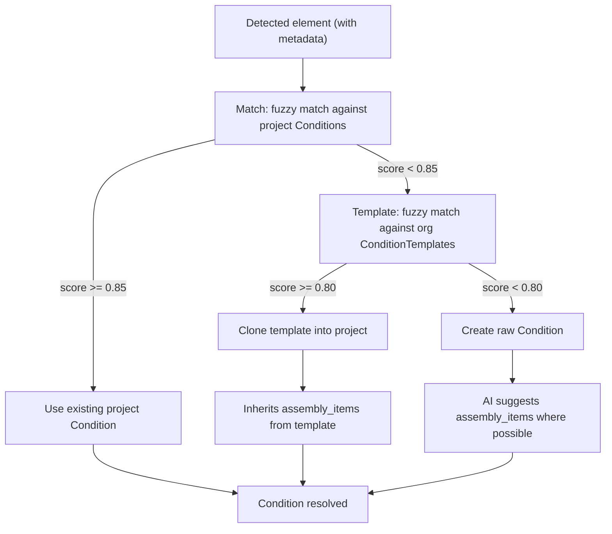

# AI Quantity Suggestions

> **Category:** AI Features
> **Priority:** P2 - Future
> **Status:** Deep-Dive Complete

## Overview

Suggest the right Conditions, Assemblies, and assembly-item formulas to attach to AI-detected elements, based on schedule extraction, legend matching, and the org's existing template library. Where [AI Element Recognition](ai-element-recognition.md) answers "what is this on the plan?" and [AI Auto-Takeoff](ai-auto-takeoff.md) answers "where does it go in the takeoff?", AI Quantity Suggestions answers "what does this element actually mean for our pricing?" -- bridging the gap between detected geometry and a fully populated estimate.

The defining behavior is **Match -> Template -> Create**: AI tries to reuse the firm's existing Conditions, then clones the closest org template (carrying its assembly items with it), and only creates a raw Condition as a last resort. This keeps AI takeoff aligned with the firm's pricing standards instead of generating noise that ignores them.

## User Stories

- As an estimator, I want AI-detected walls to use my existing "Interior Wall - 8' Drywall" condition (with its drywall + framing + insulation assembly items) so I don't have to reapply assemblies after every AI run.
- As an estimator, I want a new finish detected from a hatch fill to be matched to my "VCT Tile" condition if I have one, before AI creates a new one from scratch.
- As an estimator, I want AI to clone the closest matching org template (with all its assembly items) when no project condition matches, so the firm's pricing knowledge follows the AI.
- As a project owner, I want to see which conditions were created by AI vs by me, so I can audit and clean up.
- As a team lead, I want a gentle nudge when AI creates a new raw condition: "Save to your team library?" so our template pool grows organically without forcing manual setup.
- As an estimator, I want AI to suggest assembly items (e.g., "carpet at $X/SF + adhesive at $Y/SF + labor") based on the matched legend description, even when no matching template exists, so my new conditions arrive partially populated.
- As an estimator, I want unit consistency -- AI-created conditions in an imperial project should use SF/LF, in a metric project should use sqm/m -- without me having to fix it every time.

## Key Requirements

### Match -> Template -> Create Resolution

For every AI-detected element that needs a Condition assigned, run this resolver:

#### Stage 1: Match Existing Project Conditions

- Build a fuzzy match against the project's existing Conditions on `(name, measurement_type, unit)`.
- **Name matching** uses sentence embeddings (small local model or hosted embedding API) cached per condition. Cosine similarity threshold: 0.85.
- **Measurement type must match exactly** -- a count condition can never resolve to an area condition.
- **Unit normalization** before comparison (e.g., `SF` ≡ `Sq Ft` ≡ `ft²`).
- Tie-breaker: prefer conditions already used on the current sheet, then conditions with most existing measurements project-wide.

#### Stage 2: Clone From Org Template Library

- If no project Condition matches, fuzzy-match against `condition_templates` (see `backend/app/models/condition_template.py`).
- Threshold: 0.80 (slightly looser than project match because templates are intentionally more general).
- On match, **clone the template** into the project as a new `Condition`:
    - Copy: `name`, `measurement_type`, `unit`, `color`, `line_style`, `line_width`, `fill_opacity`, `fill_pattern`, `properties`, `trade`, `description`.
    - Also copy `assembly_items` from the template into project-scoped `AssemblyItem` rows tied to the new Condition.
- The cloned condition is tagged with `source = template_clone` and `source_template_id` so the audit trail shows where it came from.

#### Stage 3: Create Raw Condition (Last Resort)

- Only reached when no project or template match is found.
- **Name from schedule/legend description** -- LLM-summarized to a short, consistent name (e.g., "6'-0" Single Door", "Carpet - Corridor"). The full description is preserved in `description`.
- **Unit from project unit system:**
    - Imperial project: `SF` for area, `LF` for linear, `EA` for count.
    - Metric project: `m²` for area, `m` for linear, `EA` for count.
- **Measurement type from element type:** wall -> linear, room/hatch -> area, symbol/balloon -> count.
- **Default styling per measurement_type:** preset color palette, `line_width = 2.0`, `fill_opacity = 0.3`, `fill_pattern = solid`.
- The raw condition is tagged with `source = ai_created`. The next time the user opens it, the condition panel shows: "This condition was created by AI. Save to your team library?" -- pushing template growth without forcing it.

### Assembly Item Suggestions for Raw Conditions

When AI must create a raw Condition (Stage 3), it tries to suggest assembly items so the new condition is not entirely empty:

- **Element-type-aware templates.** Default starter assemblies per measurement_type (e.g., a new area condition gets a placeholder `material_cost` and `labor_cost` item with empty cost values for the user to fill in).
- **Description-driven suggestions.** When the schedule/legend description mentions known materials (e.g., "carpet", "VCT", "epoxy"), suggest assembly items mapped to those materials from a built-in dictionary. Costs are left blank or set to org-level default rates if those exist.
- **LLM enrichment** (optional): an LLM call can propose 2-4 typical assembly items for the description, marked as suggestions for user review.
- All AI-suggested assembly items are tagged `source = ai_suggested` so the user can distinguish them from items they (or a template) created.

### Schedule-Driven Quantity Suggestions

When [AI Auto-Takeoff](ai-auto-takeoff.md) Stage 3a extracts a schedule, it carries metadata that informs both the Condition and the assembly items:

- **Tag column** -> condition-key for matching across the plan.
- **Description column** -> condition `name` and `description`.
- **Quantity column** (when present, e.g., "QTY: 4") -> override the AI's plan-derived count if it disagrees significantly. Surface a warning when they diverge.
- **Dimension columns** (e.g., width, height) -> populate condition `properties` so they're available as formula variables in assemblies.
- **Material column** -> seed assembly item suggestions.

### Unit System Consistency

- Every AI-created Condition adopts the project's `units` setting (`imperial` | `metric`) from the parent organization's `default_units` and any project override.
- Schedule data that explicitly specifies a different unit (e.g., a metric door schedule in an imperial project) is converted at extraction time, with the original recorded in the schedule metadata.
- Assembly items inherit the same unit consistency rule.

### Condition Provenance

New columns on `conditions`:

- `source` -- one of `'user'` (default), `'template_clone'`, `'ai_created'`, `'imported'`.
- `source_template_id` -- nullable FK to `condition_templates`, set when source is `template_clone`.
- `source_ai_run_id` -- nullable FK to `ai_runs`, set when source is `ai_created`.

This enables:

- "Conditions created by AI" filter in the condition manager.
- Per-run audit ("Run #7 created 4 new conditions").
- The "Save to library?" nudge UI on first user view of an AI-created condition.

### Suggestion Output Lifecycle

Quantity Suggestions never write directly to user-visible Conditions/Assemblies without a clear marker:

- **Stage 1 matches** -> existing condition reused, no new row.
- **Stage 2 clones** -> new Condition row tagged `template_clone`.
- **Stage 3 raw creates** -> new Condition row tagged `ai_created`.
- **AI-suggested assembly items** -> tagged `ai_suggested` per row, with a small AI badge in the assembly editor.

The user can convert any AI-suggested item to a fully owned item by editing it; the tag clears on save.

### Re-Run Behavior

- Re-running [AI Auto-Takeoff](ai-auto-takeoff.md) re-runs the resolver per element. Already-matched conditions stay matched. Already-cloned conditions are reused (the resolver finds them in Stage 1 the second time). Already-created raw conditions are reused.
- Conditions are **never auto-deleted** by a re-run, even if no measurement currently uses them. Cleanup is a user action.
- When a re-run finds a better match (e.g., the user added a project condition that now matches), it surfaces a "Reassign?" prompt rather than silently switching existing measurements.

## Nice-to-Have

- **Cross-project learning.** When the same description repeatedly resolves to the same template, learn the mapping and accelerate the resolver for future projects in the org.
- **Suggested formulas.** When dimensional metadata is available (height, depth, thickness), suggest derived-quantity formulas (e.g., for a wall condition: `length * height = wall_area`).
- **Bulk template promotion.** "These 12 AI-created conditions match across 3 recent projects. Promote to org templates?"
- **Confidence-weighted matching.** Track condition match accuracy over time. If users consistently override Stage 1 matches, lower the threshold for that condition.
- **Cost-aware suggestions** (depends on [AI Cost Estimation](ai-cost-estimation.md)). When AI Cost Estimation is available, suggest unit costs for AI-suggested assembly items based on historical data.
- **Multi-language descriptions.** Schedules in non-English languages get matched against translated condition names.

## Competitive Landscape

| Competitor | How They Handle It |
|------------|--------------------|
| PlanSwift | Manual condition setup per project. No AI suggestion of conditions or assembly items. |
| Bluebeam | Markup-based; no concept of conditions or assemblies in the takeoff sense. |
| On-Screen Takeoff | Condition library exists but no AI mapping; users select conditions manually for each measurement. |
| Togal.AI | Detects elements and assigns to predefined condition categories, but does not match against the firm's own template library or assembly items. |

Contruo's edge: AI Quantity Suggestions is the only system in the market that **clones from the firm's template library with full assembly inheritance**. Templates are how estimating firms encode their pricing knowledge; honoring them is what turns AI takeoff from a toy into a power tool.

## Open Questions

- [ ] What's the right embedding model for condition-name matching? Local (sentence-transformers, no extra cost) vs hosted (slightly higher quality, per-call cost)?
- [ ] How aggressive should the "Save to your team library?" nudge be -- shown once on first view, or persistent until dismissed?
- [ ] Should there be a manual override mode where the user can pre-assign all AI detections to a specific condition for one run (useful for bulk condition reassignment)?
- [ ] When a schedule's quantity column disagrees with the AI's plan-derived count, which one wins by default?
- [ ] Should AI-suggested assembly items have estimated cost values (requires cost data) or always be blank?
- [ ] How do we handle units that don't fit cleanly into imperial/metric (e.g., CY for concrete, CWT for steel)?
- [ ] Should the condition-source tag (`ai_created`, `template_clone`) be visible to all team members or only to admins?

## Technical Considerations

- **Embedding cache.** Per-org embeddings for all conditions and templates, computed on create/update and cached in Postgres or a vector column. Resolver lookups become a fast vector similarity query, not a per-call API hit.
- **Template assembly cloning.** When cloning a template, the assembly items live as JSONB on the template -- the resolver expands them into project-scoped `AssemblyItem` rows in a single transaction so the new condition is fully usable immediately.
- **Resolver as a pure function.** The resolver takes `(detected_element_metadata, project_conditions, org_templates, project_units)` and returns `(condition_id, source, suggested_items)`. This makes it testable in isolation and reusable outside of AI Auto-Takeoff (e.g., for manual condition creation suggestions in the future).
- **Schedule -> condition cardinality.** A single schedule row often produces a single condition (e.g., "Door Type A" -> "6'-0" Single Door"). When schedules group multiple variations under one row, the resolver creates one condition with `properties` capturing the variations.
- **`condition_templates` model is reused** as-is; this feature requires no schema changes to it. The new provenance columns live on `conditions` and `assembly_items`.
- **LLM call budgeting.** The only LLM calls in this feature are (a) name summarization for raw-create conditions and (b) optional assembly-item enrichment. Both are heavily cached by `(input_text, model_version)` since the same descriptions recur across projects.
- **Background pre-compute.** When a project is created, pre-embed the org's templates so the first AI run doesn't pay the embedding cost.

## Notes

- This feature is the conceptual heart of Contruo's AI takeoff strategy. Detection (perception) is increasingly commoditized; what differentiates an AI takeoff product is whether the output **fits the firm's existing way of working**. Match -> Template -> Create is that fit.
- The "Save to your team library?" nudge is intentionally subtle. The lesson from team-template adoption in similar products is that aggressive prompts get dismissed; passive prompts at the right moment (just after a successful AI run) get accepted.
- The dependency on [AI Cost Estimation](ai-cost-estimation.md) for suggested cost values is real but optional -- this feature ships useful even with blank costs, because the assembly structure itself is the bigger value.
- Provenance tagging on conditions (and assembly items) is a small data change with outsized UX value: it powers the audit, the nudge, the per-run summary, and future features like "promote AI-created conditions to templates" without retrofitting.
