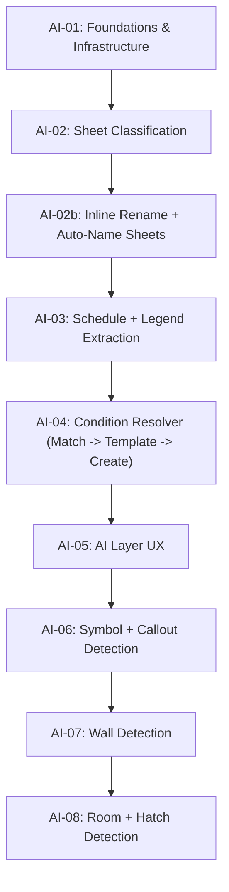

# Contruo AI Auto-Takeoff Roadmap

> **Track:** AI / Auto-Takeoff (post-MVP, P1)
> **Sprint Duration:** 2 weeks each
> **Total Sprints:** 8
> **Estimated Timeline:** ~~16 weeks (~~4 months)
> **Methodology:** Agile sprints with deliverables at the end of each
> **Depends On:** MVP (Sprints 01-16) shipped to production

**Current position (as of 2026-05):** Sprints **AI-01**, **AI-02**, **AI-02b**, and **AI-03** are **complete**. AI-02b shipped both the inline sheet rename (Part A) and an auto-name-sheets flow that supersedes the original manual-bbox redesign goal (see [Sprint AI-02b](sprint-ai-02b.md)). AI-03 shipped Stage 3a (schedule + legend extraction). **Next:** [Sprint AI-04](sprint-ai-04.md) (condition resolver). Two follow-on sprints exist as stubs: **AI-03b** (legend manual override) and **AI-03c** (sheet classifier accuracy + image-only legend OCR), to be scheduled if real-data signal demands.

---

## Why a Separate Track

AI Auto-Takeoff is large enough and architecturally distinct enough to warrant its own sprint sequence rather than being slotted into the MVP roadmap as one or two sprints. It introduces:

- A new Celery task DAG and queue (`ai_pipeline` in AI-01)
- New tables (`ai_runs`, `ai_layer_items`, `extracted_schedules`, `extracted_legends`, `ai_stage_cache`)
- New columns on existing tables (`measurements`, `conditions`, `sheets` -- provenance + sheet classification)
- Vendor model integrations (vision + embeddings) behind abstraction interfaces
- A new UI surface (the AI Layer) that overlays the existing plan viewer
- A new pricing/cost-tracking discipline (heuristics-first, content-hash caching)

Slicing this into 8 sprints lets each one ship a user-visible win and keeps the architectural changes scoped.

---

## Phase Overview

---

## Sprint Plan

| Sprint                            | Focus                                             | Key Deliverable                                                                                                                           |
| --------------------------------- | ------------------------------------------------- | ----------------------------------------------------------------------------------------------------------------------------------------- |
| [Sprint AI-01](sprint-ai-01.md)   | Foundations & Infrastructure                      | New tables + Celery AI queue + provider abstraction + per-sheet AI lock + manual "Run Auto-Takeoff" trigger end-to-end                    |
| [Sprint AI-02](sprint-ai-02.md)   | Sheet Classification                              | Lexical + vision sheet classifier, sheet index UI updates. (Title-block work moved to AI-02b after the AI-02 cut was withdrawn.)          |
| [Sprint AI-02b](sprint-ai-02b.md) | Inline Sheet Rename + Auto-Name Sheets            | Inline sheet rename + plan-wide auto-name task that reads the title block on demand. Both shipped.                                        |
| [Sprint AI-03](sprint-ai-03.md)   | Schedule + Legend Extraction                      | Multi-strategy schedule extraction, heuristic-first tag column ID, legend symbol templates in Storage. **Shipped.**                       |
| Sprint AI-03b (TBD)               | Legend Manual Override                            | Optional. Non-blocking "Set legend region" button that posts a bbox + triggers a per-sheet re-extract. Schedule when real-data hit rate demands it. |
| Sprint AI-03c (TBD)               | Classifier Accuracy + Image-Only Legends          | Optional. LLM-on-title classifier rewrite, OCR for legends without a text layer, polygon / circle / triangle symbol shapes.               |
| [Sprint AI-04](sprint-ai-04.md)   | Condition Resolver                                | OpenAI embedding integration, Match -> Template -> Create resolver, template cloning, "Save to library?" nudge                            |
| [Sprint AI-05](sprint-ai-05.md)   | AI Layer UX                                       | AI Layer overlays, review panel, confidence-tiered behavior, run health summary, keyboard shortcuts                                       |
| [Sprint AI-06](sprint-ai-06.md)   | Symbol + Callout Detection                        | OpenCV multi-scale template matching, callout balloon detection, tag-to-drawing mapping; first end-to-end count measurements via AI Layer |
| [Sprint AI-07](sprint-ai-07.md)   | Wall Detection                                    | Vector parallel-pair clustering, opening detection, single-row wall geometry storage, viewer display toggle                               |
| [Sprint AI-08](sprint-ai-08.md)   | Room + Hatch Detection                            | Planar-graph rooms, raster fallback, hatch detection (vector + raster), legend swatch matching                                            |

---

## Dependencies

Note: AI-02, AI-02b, and AI-03 ran partially in parallel because classification, auto-name, and schedule/legend extraction share infrastructure but not detection logic. AI-03 was not strictly blocked on AI-02b — the chain just runs auto-name as a best-effort pre-prep hook (see `pipeline_prep_auto_name` in [docs/architecture/ai-pipeline.md](../../docs/architecture/ai-pipeline.md)).

---

## Sprint Status Tracker

| Sprint | Status       | Start Date | End Date | Notes                                                                                                                                                                                   |
| ------ | ------------ | ---------- | -------- | --------------------------------------------------------------------------------------------------------------------------------------------------------------------------------------- |
| AI-01  | **Complete** | 2026-04    | 2026-04  | See [What shipped in AI-01](#what-shipped-in-ai-01) below.                                                                                                                              |
| AI-02  | **Complete** | 2026-04    | 2026-04  | Sheet classification only. Title-block work was moved to AI-02b after the original cut was withdrawn. See [What shipped in AI-02](#what-shipped-in-ai-02) below.                        |
| AI-02b | **Complete** | 2026-04    | 2026-05  | Inline sheet rename + auto-name-sheets shipped (the manual-bbox redesign was superseded by an auto-name flow that reads the title block on demand). See [What shipped in AI-02b](#what-shipped-in-ai-02b) below. |
| AI-03  | **Complete** | 2026-05    | 2026-05  | Stage 3a — schedule + legend extraction. See [What shipped in AI-03](#what-shipped-in-ai-03) below.                                                                                     |
| AI-03b | Not Started  | -          | -        | Optional follow-on. Manual override for low-confidence legend regions (a non-blocking "Set legend region" button on a sheet that posts a bbox + triggers a per-sheet re-extract). Schedule only if real-data hit rate is too low. |
| AI-03c | Not Started  | -          | -        | Optional follow-on. Sheet classifier accuracy fix (LLM-on-title vs vision-on-thumbnail) + OCR-based label extraction for image-only legends + line-art / polygon / circle symbol shapes in the legend detector. |
| AI-04  | Not Started  | -          | -        |                                                                                                                                                                                         |
| AI-05  | Not Started  | -          | -        |                                                                                                                                                                                         |
| AI-06  | Not Started  | -          | -        |                                                                                                                                                                                         |
| AI-07  | Not Started  | -          | -        |                                                                                                                                                                                         |
| AI-08  | Not Started  | -          | -        |                                                                                                                                                                                         |

### What shipped in AI-01

- **DB:** Alembic migration `013` — `ai_runs`, `ai_layer_items`, `extracted_schedules`, `extracted_legends`, `ai_stage_cache` (all `org_id` + RLS); provenance columns on `measurements` / `conditions`; classification columns on `sheets`.
- **Worker:** Celery `ai_pipeline` queue; 7-task chain (start + five stages + finalize) with per-stage timing in `summary_jsonb`; `liveblocks_service.broadcast_event_sync` for `ai_run.status_changed`.
- **Code:** `ai_models` (vision / embedding / LLM protocols + `with_cost_tracking`), `ai_run_service`, `ai_cache`; `POST/GET` project AI run APIs; `GET /internal/ai/cost-by-org` (owner-only).
- **UI:** "Run AI" in plan viewer (left of takeoff toolbar) + status pill; `useActiveAiRun` + Liveblocks merge.
- **Tests & docs:** Unit tests for run service, models, endpoints, pipeline; `docs/architecture/ai-pipeline.md`, `docs/ops/ai-runs-monitoring.md`, `backend/README.md`.

### What shipped in AI-02

> **Scope note:** AI-02 originally included Stage 1 title-block auto-detect + manual fallback. That cut was withdrawn after it failed to perform on real plans (low-confidence detection landed everywhere except the actual title block; the “manual fallback dialog” inherited the same broken bbox seed). Title-block work is now in [Sprint AI-02b](sprint-ai-02b.md). What follows is what survived the reset.

- **DB:** Alembic migration `014` — widened `ai_runs.status` to `VARCHAR(40)`; added `plans.title_block_bbox JSONB`, `plans.title_block_confidence FLOAT`, `plans.title_block_source VARCHAR(20)`. The three `plans.title_block_`* columns are kept in place (dormant) for the AI-02b redesign so we don’t need a migration to bring them back. No RLS changes (existing `plans` policy applies).
- **Stage 1 (title block):** **No-op.** `ai_pipeline.stage_title_block` runs `_noop_stage` so the 7-task chain shape is preserved. `TITLE_BLOCK_DETECT_VERSION`, `ai_title_block.py`, `_stage_title_block_body`, `per_sheet_extract_title_task`, `reextract_plan_titles_task`, and the `ai_run_service.pause_run_for_title_block_sync` / `resume_run_after_title_block` helpers were all removed.
- **Stage 2 (classification):** `ai_sheet_classifier.classify_lexical` (prefix + keyword rules) with vision-fallback batches via `AnthropicVisionModel.classify_image` (now real, was a stub in AI-01); cover/index/spec sheets never escalate to vision (D6 optimization); `bulk_upsert_classifications` writes `discipline` / `sheet_type` / `classification_confidence` / `classification_method` onto `sheets`.
- **OCR helper:** `ai_ocr` Tesseract wrapper with graceful degradation when the binary is missing — kept as infrastructure for AI-02b and AI-03.
- **Pause / resume:** **Removed.** No status pause path exists in the chain anymore. `ai_runs.status` no longer carries `awaiting_title_block` (column kept at `VARCHAR(40)` for forward use); `summary_jsonb.pause` is no longer written. The `confirm_title_block` API endpoint and `build_partial_chain_after_title_block` helper were removed.
- **API:** `ConfirmTitleBlockRequest` schema and `POST /api/v1/projects/{pid}/ai/runs/{rid}/title-block` were removed. `SheetSummary` + `SheetListItemResponse` carry the 4 classification fields. `PlanResponse` is deliberately unchanged (no bbox leak).
- **UI:** `sheet-index.tsx` shipped (discipline color-dots, sheet-type pills, low-confidence indicators, search + filter dropdown). `title-block-confirm-dialog.tsx`, the `'awaiting_title_block'` pill in `RunAutoTakeoffButton`, the auto-open-on-pause effect, and the `confirmTitleBlock` client were all removed.
- **Tests:** `test_ai_sheet_classifier`, `test_ai_ocr`, the surviving `test_ai_pipeline_tasks` cases (chain shape + Stage 2 paths) are green. `test_ai_title_block`, `test_ai_title_block_endpoint`, `test_ai_pause_resume`, and the title-block / pause / re-extract cases inside `test_ai_pipeline_tasks` were removed. Anthropic SDK mocked at the boundary; zero real model calls in CI.
- **Docs:** `docs/architecture/ai-pipeline.md` describes Stage 1 as a no-op pending AI-02b; `backend/README.md` and `backend/.env.example` carry the AI-02 env vars used by the surviving classifier path.

### What shipped in AI-02b

Follow-on spun out of AI-02 to address two real-world failure modes (wrong/empty
auto-extracted sheet names with no easy fix; a few pre-existing bad names from
the upload pipeline). The full spec lives in [sprint-ai-02b.md](sprint-ai-02b.md).

**Part A — Inline sheet rename (shipped):**

- **DB:** Alembic migration `015` — `sheets.sheet_name_source VARCHAR(20) NULL` (`'auto'`  `'manual'`  `NULL`). Source-of-truth column carried through `Sheet` model, `SheetSummary`, and `SheetListItemResponse`.
- **API:** `PATCH /api/v1/sheets/{id}` → `sheet_service.rename_sheet(...)` trims, validates non-empty, and sets `sheet_name_source='manual'`. Permission: `EDIT_MEASUREMENTS`. Empty/whitespace returns 422 (`SHEET_NAME_EMPTY`).
- **UI:** `sheet-index.tsx` adds a pencil button + double-click → inline `<input>` (Enter saves, Esc cancels), optimistic update with revert-on-error, subtle dot indicator for `sheet_name_source === 'manual'`. New client `frontend/lib/sheets.ts::renameSheet`.
- **Tests:** `test_sheet_rename_endpoint` (4 cases) — green.

**Part B — Auto-name sheets (shipped; supersedes the original "manual title-block bbox" plan):**

- **Status:** The reset opened the door to a simpler design that ships the user-visible value (correct sheet names + numbers) without the manual-draw-bbox UX surface. Instead of asking the user to draw a region, an "Auto-name sheets" button on the plan viewer enqueues a Celery task that re-extracts `sheet_name` + `sheet_number` from the title block of every sheet. Manual renames (`sheets.sheet_name_source = 'manual'`) are always preserved. The `_sheet_eligible_for_auto_name` guard in `ai_title_block` enforces this on every write path.
- **DB:** Alembic migration `016` — `sheets.sheet_number VARCHAR(40) NULL`. Both `sheet_name` and `sheet_number` are guarded by `sheet_name_source` together (one rename marks both 'manual').
- **API:** `POST /api/v1/projects/{pid}/plans/{plan_id}/auto-name-sheets` → `ai_pipeline.reextract_plan_titles_task` (non-blocking). The task acquires the per-plan AI lock so it can't race a concurrent AI run. Returns 503 (`AUTO_NAME_DISABLED`) when `AI_AUTO_NAME_ENABLED=false`.
- **Worker:** `ai_title_block.reextract_titles_for_plan` runs three branches per sheet: bottom-right corner heuristic on the text layer → `ai_ocr` Tesseract fallback → `OpenAILLMModel.structured_output` cleanup pass for any sheet where the heuristic / OCR returned a low-confidence answer. The LLM provider is decoupled (`AI_TITLE_BLOCK_LLM_PROVIDER`); strict JSON-schema mode prevents prose leaks.
- **UI:** "Auto-name sheets" button in the plan viewer header alongside "Run Auto-Takeoff". `sheets.auto_named` Liveblocks broadcast prompts the sheet index to refetch.
- **Carried forward into AI-03:** the `_sheet_eligible_for_auto_name` pattern (every write path that touches a sheet field guarded by `sheet_name_source` checks it first), and the `get_title_block_llm()` -> `OpenAILLMModel.structured_output` factory pattern (now mirrored in `ai_models.get_schedules_llm`).
- **Not implemented (deferred):** click-to-pick title-block bbox. The auto-name flow proved the bbox is reliably the bottom-right corner; a manual override is not worth the UX surface today.

### What shipped in AI-03

Stage 3a of the AI Auto-Takeoff pipeline. `ai_pipeline.stage_schedules_legends` is no longer a no-op: it extracts schedule tables and crops legend symbols on the relevant sheets, populating the contract `extracted_schedules` / `extracted_legends` / `extracted_legend_variants` tables that AI-04 (resolver) and AI-06 (symbol detector) consume.

- **DB:** Alembic migration `017` — `extracted_schedules` gains `description_column_index`, `quantity_column_index`, `dimension_column_indexes` (JSONB array), `material_column_index`. New table `extracted_legend_variants` (one row per (symbol, scale, rotation); 5 scales x 4 rotations = 20 variants per primary symbol). Variants live in their own table so AI-04's resolver, which only needs labels, doesn't pay 20x egress on its read path.
- **Sheet selection:** `ai_sheet_filter.select_schedule_sheets` / `select_legend_sheets` filter on `sheet_name` keywords (`%schedule%`, `%legend%`, `%symbol%`, etc.). The AI-02 classifier output is intentionally NOT used as a gate here -- accuracy issues are tracked under AI-03c.
- **Schedule extractor:** `ai_schedule_extractor` runs `pdfplumber.lines_strict` -> `pdfplumber.lines` -> `pdfplumber.text` -> vision fallback (`AnthropicVisionModel.extract_structured`, newly wired). Each strategy is gated by a row-width-variance quality scorer so noise matches don't pollute the resolver input.
- **Tag-column scorer:** `ai_tag_column.score_columns` runs a 4-feature deterministic scorer (header keyword + cell shape + uniqueness + first-column bias) and identifies tag / description / quantity / dimension(s) / material columns. Tag column is the only role with an LLM tie-break (`get_schedules_llm`, OpenAI `gpt-4o-mini` strict-JSON), gated by score-margin + skip-above thresholds. Cached in `ai_stage_cache` so re-runs cost nothing.
- **Legend detector:** `ai_legend_detector` is a faithful port of `AI/controller/legends.py` (group rects by rounded x0 / x1 -> filter to most-common size -> drop rects with text inside -> find adjacent label) plus an additive multi-direction label search (right + above) and per-symbol confidence scoring. Sub-threshold detections are silently skipped (logged in `summary_jsonb`); manual override deferred to optional AI-03b.
- **Legend extractor:** `ai_legend_extractor.persist_legend_candidates` renders each symbol at 300 DPI, computes `template_hash = sha256(primary_bytes)`, generates the (5 scales x 4 rotations) variant grid via PIL transforms (faster than re-rendering from PDF), uploads each variant to deterministic Supabase Storage paths (`{org_id}/legends/{plan_id}/{hash}_s{scale}_r{rotation}.png`), and writes one `extracted_legends` + 20 `extracted_legend_variants` rows. `persist_from_cached_metadata` is the cache-hit fast path that re-inserts DB rows without re-rendering or re-uploading.
- **Pipeline body:** `_stage_schedules_legends_body` orchestrates the per-sheet flow with content-hash caching (`stage="schedules_v1"` and `stage="legends_v1"`). Per-sheet failures are logged and swallowed -- one bad sheet does not fail the stage. Counters (`schedules_extracted`, `legend_symbols_extracted`, `legend_variants_written`, cache hits, vision fallbacks, LLM tie-breaks) flow into `ai_runs.summary_jsonb["schedules_legends"]` for the run-summary panel.
- **Internal API + UI:** `GET /internal/ai/runs/{ai_run_id}/extractions` (owner + admin) and `frontend/app/(app)/internal/ai/runs/[runId]/extractions/page.tsx` render every extracted schedule (with the column-role colour tags) and every legend symbol (with its 20-variant grid). NOT linked from the customer-facing UI; engineering navigates directly.
- **Tests:** New unit tests for the sheet filter, schedule extractor, tag-column scorer, legend detector, legend extractor (mocked storage), legend storage helpers, and the new `get_schedules_llm` factory. Real model APIs are mocked at the boundary (no network calls in CI). 31 new tests, all green.
- **Docs:** `backend/README.md` carries the AI-03 env-var section. `docs/architecture/ai-pipeline.md` describes Stage 3a end-to-end.

---

## Feature-to-Sprint Mapping

| Feature File                             | AI Sprint(s)                                    |
| ---------------------------------------- | ----------------------------------------------- |
| `features/ai/ai-auto-takeoff.md`         | AI-01, AI-02, AI-03, AI-05, AI-06, AI-07, AI-08 |
| `features/ai/ai-element-recognition.md`  | AI-06, AI-07, AI-08                             |
| `features/ai/ai-quantity-suggestions.md` | AI-04                                           |

---

## Locked Decisions Carried Across Sprints

These decisions are global to the AI track and reflected in every sprint:

- **AI cost is included in the Contruo subscription.** No user-facing meter or cap. Internal tracking + abuse circuit breaker only.
- **Plan-revision auto-trigger is deferred.** v1 is manual-trigger only.
- **Default vision provider:** Anthropic Claude Sonnet (current generation), behind a `VisionModel` abstraction.
- **Default embedding provider:** OpenAI `text-embedding-3-small`, behind an `EmbeddingModel` abstraction.
- **Heuristics-first at every stage.** Vision/LLM calls are fallbacks, not defaults.
- **All AI geometry stored in PDF user space points** so existing measurement math works unchanged.
- **Confidence-tiered AI Layer behavior:** auto-accept >= 0.9, pending 0.6-0.9, hidden < 0.6 (defaults configurable).
- **Provenance tagging required:** `source` and `ai_run_id` on `measurements`; `source`, `source_template_id`, `source_ai_run_id` on `conditions`.

---

## Out of Scope for This Track

These are intentionally not part of the 8-sprint plan and are tracked elsewhere:

- **AI Cost Estimation** (`features/ai/ai-cost-estimation.md`) -- depends on cost database, separate P2 work.
- **AI Plan Comparison** (`features/ai/ai-plan-comparison.md`) -- benefits from this track's geometry pipeline but is a separate P2 effort.
- **Review Queue mode** (Gmail-style linear walkthrough) -- listed as Nice-to-Have in `features/ai/ai-auto-takeoff.md`. Considered after the 8-sprint track ships and stabilizes.
- **Custom symbol training** (per-project symbol upload) -- post-track enhancement.
- **Auto-trigger on plan revision** -- post-track enhancement.

