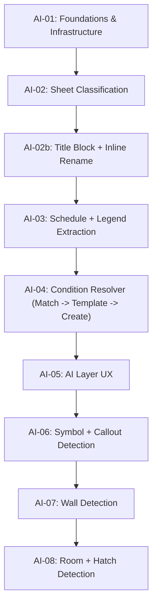
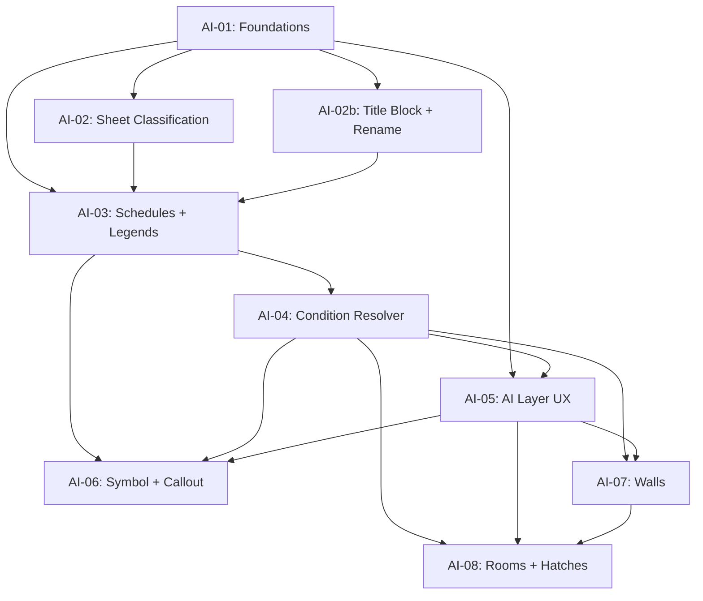

# Contruo AI Auto-Takeoff Roadmap

> **Track:** AI / Auto-Takeoff (post-MVP, P1)
> **Sprint Duration:** 2 weeks each
> **Total Sprints:** 8
> **Estimated Timeline:** ~~16 weeks (~~4 months)
> **Methodology:** Agile sprints with deliverables at the end of each
> **Depends On:** MVP (Sprints 01-16) shipped to production

**Current position (as of 2026-04):** Sprint **AI-01** and **AI-02 (Sheet Classification)** are **complete**. Sprint **AI-02b** is **partial** — the inline sheet rename shipped, but the manual title-block bbox flow was reset and is in redesign (see [Sprint AI-02b](sprint-ai-02b.md)). **Next blocker:** finish the AI-02b title-block redesign, then [Sprint AI-03](sprint-ai-03.md) (schedule + legend extraction).

---

## Why a Separate Track

AI Auto-Takeoff is large enough and architecturally distinct enough to warrant its own sprint sequence rather than being slotted into the MVP roadmap as one or two sprints. It introduces:

- A new Celery task DAG and queue (`ai_pipeline` in AI-01)
- New tables (`ai_runs`, `ai_layer_items`, `extracted_schedules`, `extracted_legends`, `ai_stage_cache`)
- New columns on existing tables (`measurements`, `conditions`, `sheets` -- provenance + sheet classification)
- Vendor model integrations (vision + embeddings) behind abstraction interfaces
- A new UI surface (the AI Layer) that overlays the existing plan viewer
- A new pricing/cost-tracking discipline (heuristics-first, content-hash caching)

Slicing this into 8 sprints lets each one ship a user-visible win and keeps the architectural changes scoped.

---

## Phase Overview

---

## Sprint Plan

| Sprint                            | Focus                                             | Key Deliverable                                                                                                                           |
| --------------------------------- | ------------------------------------------------- | ----------------------------------------------------------------------------------------------------------------------------------------- |
| [Sprint AI-01](sprint-ai-01.md)   | Foundations & Infrastructure                      | New tables + Celery AI queue + provider abstraction + per-sheet AI lock + manual "Run Auto-Takeoff" trigger end-to-end                    |
| [Sprint AI-02](sprint-ai-02.md)   | Sheet Classification                              | Lexical + vision sheet classifier, sheet index UI updates. (Title-block work moved to AI-02b after the AI-02 cut was withdrawn.)          |
| [Sprint AI-02b](sprint-ai-02b.md) | Title Block Manual Override + Inline Sheet Rename | Inline sheet rename (shipped) + manual title-block bbox redesign (reset; spec carried for next attempt).                                  |
| [Sprint AI-03](sprint-ai-03.md)   | Schedule + Legend Extraction                      | Multi-strategy schedule extraction, heuristic-first tag column ID, legend symbol templates in Storage                                     |
| [Sprint AI-04](sprint-ai-04.md)   | Condition Resolver                                | OpenAI embedding integration, Match -> Template -> Create resolver, template cloning, "Save to library?" nudge                            |
| [Sprint AI-05](sprint-ai-05.md)   | AI Layer UX                                       | AI Layer overlays, review panel, confidence-tiered behavior, run health summary, keyboard shortcuts                                       |
| [Sprint AI-06](sprint-ai-06.md)   | Symbol + Callout Detection                        | OpenCV multi-scale template matching, callout balloon detection, tag-to-drawing mapping; first end-to-end count measurements via AI Layer |
| [Sprint AI-07](sprint-ai-07.md)   | Wall Detection                                    | Vector parallel-pair clustering, opening detection, single-row wall geometry storage, viewer display toggle                               |
| [Sprint AI-08](sprint-ai-08.md)   | Room + Hatch Detection                            | Planar-graph rooms, raster fallback, hatch detection (vector + raster), legend swatch matching                                            |

---

## Dependencies

Note: AI-02, AI-02b, and AI-03 can run partially in parallel once AI-01 ships, since classification, the manual title-block override, and schedule/legend extraction share infrastructure but not detection logic. AI-03 is not strictly blocked on AI-02b — the chain still walks past Stage 1 as a no-op while the redesign is in progress.

---

## Sprint Status Tracker

| Sprint | Status       | Start Date | End Date | Notes                                                                                                                                                                                   |
| ------ | ------------ | ---------- | -------- | --------------------------------------------------------------------------------------------------------------------------------------------------------------------------------------- |
| AI-01  | **Complete** | 2026-04    | 2026-04  | See [What shipped in AI-01](#what-shipped-in-ai-01) below.                                                                                                                              |
| AI-02  | **Complete** | 2026-04    | 2026-04  | Sheet classification only. Title-block work was moved to AI-02b after the original cut was withdrawn. See [What shipped in AI-02](#what-shipped-in-ai-02) below.                        |
| AI-02b | **Partial**  | 2026-04    | -        | Inline sheet rename **shipped**; manual title-block bbox flow **reset**, redesign in [sprint-ai-02b.md](sprint-ai-02b.md). See [What shipped in AI-02b](#what-shipped-in-ai-02b) below. |
| AI-03  | Not Started  | -          | -        | Next: schedule + legend extraction.                                                                                                                                                     |
| AI-04  | Not Started  | -          | -        |                                                                                                                                                                                         |
| AI-05  | Not Started  | -          | -        |                                                                                                                                                                                         |
| AI-06  | Not Started  | -          | -        |                                                                                                                                                                                         |
| AI-07  | Not Started  | -          | -        |                                                                                                                                                                                         |
| AI-08  | Not Started  | -          | -        |                                                                                                                                                                                         |

### What shipped in AI-01

- **DB:** Alembic migration `013` — `ai_runs`, `ai_layer_items`, `extracted_schedules`, `extracted_legends`, `ai_stage_cache` (all `org_id` + RLS); provenance columns on `measurements` / `conditions`; classification columns on `sheets`.
- **Worker:** Celery `ai_pipeline` queue; 7-task chain (start + five stages + finalize) with per-stage timing in `summary_jsonb`; `liveblocks_service.broadcast_event_sync` for `ai_run.status_changed`.
- **Code:** `ai_models` (vision / embedding / LLM protocols + `with_cost_tracking`), `ai_run_service`, `ai_cache`; `POST/GET` project AI run APIs; `GET /internal/ai/cost-by-org` (owner-only).
- **UI:** "Run AI" in plan viewer (left of takeoff toolbar) + status pill; `useActiveAiRun` + Liveblocks merge.
- **Tests & docs:** Unit tests for run service, models, endpoints, pipeline; `docs/architecture/ai-pipeline.md`, `docs/ops/ai-runs-monitoring.md`, `backend/README.md`.

### What shipped in AI-02

> **Scope note:** AI-02 originally included Stage 1 title-block auto-detect + manual fallback. That cut was withdrawn after it failed to perform on real plans (low-confidence detection landed everywhere except the actual title block; the “manual fallback dialog” inherited the same broken bbox seed). Title-block work is now in [Sprint AI-02b](sprint-ai-02b.md). What follows is what survived the reset.

- **DB:** Alembic migration `014` — widened `ai_runs.status` to `VARCHAR(40)`; added `plans.title_block_bbox JSONB`, `plans.title_block_confidence FLOAT`, `plans.title_block_source VARCHAR(20)`. The three `plans.title_block_`* columns are kept in place (dormant) for the AI-02b redesign so we don’t need a migration to bring them back. No RLS changes (existing `plans` policy applies).
- **Stage 1 (title block):** **No-op.** `ai_pipeline.stage_title_block` runs `_noop_stage` so the 7-task chain shape is preserved. `TITLE_BLOCK_DETECT_VERSION`, `ai_title_block.py`, `_stage_title_block_body`, `per_sheet_extract_title_task`, `reextract_plan_titles_task`, and the `ai_run_service.pause_run_for_title_block_sync` / `resume_run_after_title_block` helpers were all removed.
- **Stage 2 (classification):** `ai_sheet_classifier.classify_lexical` (prefix + keyword rules) with vision-fallback batches via `AnthropicVisionModel.classify_image` (now real, was a stub in AI-01); cover/index/spec sheets never escalate to vision (D6 optimization); `bulk_upsert_classifications` writes `discipline` / `sheet_type` / `classification_confidence` / `classification_method` onto `sheets`.
- **OCR helper:** `ai_ocr` Tesseract wrapper with graceful degradation when the binary is missing — kept as infrastructure for AI-02b and AI-03.
- **Pause / resume:** **Removed.** No status pause path exists in the chain anymore. `ai_runs.status` no longer carries `awaiting_title_block` (column kept at `VARCHAR(40)` for forward use); `summary_jsonb.pause` is no longer written. The `confirm_title_block` API endpoint and `build_partial_chain_after_title_block` helper were removed.
- **API:** `ConfirmTitleBlockRequest` schema and `POST /api/v1/projects/{pid}/ai/runs/{rid}/title-block` were removed. `SheetSummary` + `SheetListItemResponse` carry the 4 classification fields. `PlanResponse` is deliberately unchanged (no bbox leak).
- **UI:** `sheet-index.tsx` shipped (discipline color-dots, sheet-type pills, low-confidence indicators, search + filter dropdown). `title-block-confirm-dialog.tsx`, the `'awaiting_title_block'` pill in `RunAutoTakeoffButton`, the auto-open-on-pause effect, and the `confirmTitleBlock` client were all removed.
- **Tests:** `test_ai_sheet_classifier`, `test_ai_ocr`, the surviving `test_ai_pipeline_tasks` cases (chain shape + Stage 2 paths) are green. `test_ai_title_block`, `test_ai_title_block_endpoint`, `test_ai_pause_resume`, and the title-block / pause / re-extract cases inside `test_ai_pipeline_tasks` were removed. Anthropic SDK mocked at the boundary; zero real model calls in CI.
- **Docs:** `docs/architecture/ai-pipeline.md` describes Stage 1 as a no-op pending AI-02b; `backend/README.md` and `backend/.env.example` carry the AI-02 env vars used by the surviving classifier path.

### What shipped in AI-02b

Follow-on spun out of AI-02 to address two real-world failure modes (wrong/empty
auto-extracted sheet names with no easy fix; a few pre-existing bad names from
the upload pipeline). The full spec lives in [sprint-ai-02b.md](sprint-ai-02b.md).

**Part A — Inline sheet rename (shipped):**

- **DB:** Alembic migration `015` — `sheets.sheet_name_source VARCHAR(20) NULL` (`'auto'`  `'manual'`  `NULL`). Source-of-truth column carried through `Sheet` model, `SheetSummary`, and `SheetListItemResponse`.
- **API:** `PATCH /api/v1/sheets/{id}` → `sheet_service.rename_sheet(...)` trims, validates non-empty, and sets `sheet_name_source='manual'`. Permission: `EDIT_MEASUREMENTS`. Empty/whitespace returns 422 (`SHEET_NAME_EMPTY`).
- **UI:** `sheet-index.tsx` adds a pencil button + double-click → inline `<input>` (Enter saves, Esc cancels), optimistic update with revert-on-error, subtle dot indicator for `sheet_name_source === 'manual'`. New client `frontend/lib/sheets.ts::renameSheet`.
- **Tests:** `test_sheet_rename_endpoint` (4 cases) — green.

**Part B — Manual title-block bbox (reset, redesign):**

- **Status:** The first cut of the manual bbox flow (Toolbar “Set title block” → draw rect on canvas → backend persist + re-extract) was **removed** along with the AI-02 auto-detect. Reason: it inherited the same fragile pdfminer-based extractor and never produced reliable names on real plans, and the entry point only made sense as a “refresh stale auto names” override that never worked.
- **Removed (as part of the reset):** `frontend/lib/ai-title-block.ts`, `title-block-confirm-dialog.tsx`, the “Set title block” toolbar button + draw-rect overlay paths in `plan-viewer-workspace.tsx` / `plan-pdf-canvas.tsx`, the `POST /api/v1/projects/{pid}/plans/{plan_id}/title-block` endpoint, `plan_service.set_manual_title_block`, the `ai_pipeline.reextract_plan_titles_task` worker, the `ai_title_block.reextract_titles_for_plan` helper, and the `ai_cache.cache_invalidate` invalidation path for the `'title_block'` stage. The `plans.title_block_`* columns are kept in place for the redesign — no migration needed to bring them back.
- **Carried forward:** `sheets.sheet_name_source` (so the redesigned flow keeps the manual-safe guard intact) and the `ai_ocr` helper (will be the OCR fallback inside the redesign).
- **Redesign target (next attempt):** click-to-pick bbox or guided template-based extractor that uses the real text layer + `ai_ocr` fallback. Detailed acceptance criteria + non-goals + coordinate-system contract live in `sprint-ai-02b.md`.

---

## Feature-to-Sprint Mapping

| Feature File                             | AI Sprint(s)                                    |
| ---------------------------------------- | ----------------------------------------------- |
| `features/ai/ai-auto-takeoff.md`         | AI-01, AI-02, AI-03, AI-05, AI-06, AI-07, AI-08 |
| `features/ai/ai-element-recognition.md`  | AI-06, AI-07, AI-08                             |
| `features/ai/ai-quantity-suggestions.md` | AI-04                                           |

---

## Locked Decisions Carried Across Sprints

These decisions are global to the AI track and reflected in every sprint:

- **AI cost is included in the Contruo subscription.** No user-facing meter or cap. Internal tracking + abuse circuit breaker only.
- **Plan-revision auto-trigger is deferred.** v1 is manual-trigger only.
- **Default vision provider:** Anthropic Claude Sonnet (current generation), behind a `VisionModel` abstraction.
- **Default embedding provider:** OpenAI `text-embedding-3-small`, behind an `EmbeddingModel` abstraction.
- **Heuristics-first at every stage.** Vision/LLM calls are fallbacks, not defaults.
- **All AI geometry stored in PDF user space points** so existing measurement math works unchanged.
- **Confidence-tiered AI Layer behavior:** auto-accept >= 0.9, pending 0.6-0.9, hidden < 0.6 (defaults configurable).
- **Provenance tagging required:** `source` and `ai_run_id` on `measurements`; `source`, `source_template_id`, `source_ai_run_id` on `conditions`.

---

## Out of Scope for This Track

These are intentionally not part of the 8-sprint plan and are tracked elsewhere:

- **AI Cost Estimation** (`features/ai/ai-cost-estimation.md`) -- depends on cost database, separate P2 work.
- **AI Plan Comparison** (`features/ai/ai-plan-comparison.md`) -- benefits from this track's geometry pipeline but is a separate P2 effort.
- **Review Queue mode** (Gmail-style linear walkthrough) -- listed as Nice-to-Have in `features/ai/ai-auto-takeoff.md`. Considered after the 8-sprint track ships and stabilizes.
- **Custom symbol training** (per-project symbol upload) -- post-track enhancement.
- **Auto-trigger on plan revision** -- post-track enhancement.

