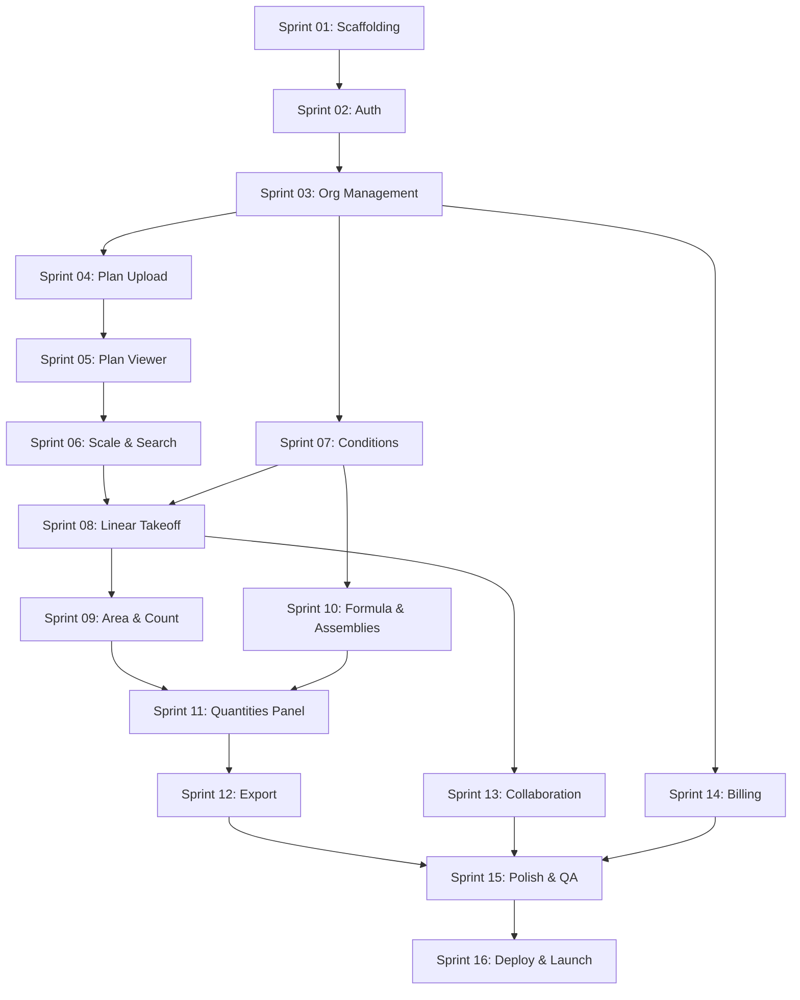

# Contruo MVP Roadmap

> **Sprint Duration:** 2 weeks each
> **Total Sprints:** 16
> **Estimated Timeline:** ~32 weeks (~7.5 months)
> **Methodology:** Agile sprints with deliverables at the end of each

---

## Phase 1: Foundation (Sprints 01-03, 6 weeks)

Build the platform foundation -- authentication, user management, and organization structure. At the end of this phase, users can sign up, create an org, invite team members, and manage roles.

| Sprint | Focus | Key Deliverable |
|--------|-------|-----------------|
| [Sprint 01](sprint-01.md) | Project scaffolding | Repo, CI/CD, dev environment, Supabase connected |
| [Sprint 02](sprint-02.md) | Auth & user management | Signup, login, email verification, password reset |
| [Sprint 03](sprint-03.md) | Organization management | Org creation, settings, invitations, roles & permissions |

---

## Phase 2: Plan Viewing (Sprints 04-06, 6 weeks)

Build the plan viewer -- the core canvas where all takeoff work happens. At the end of this phase, users can upload PDF plans, view them with full zoom/pan, navigate sheets, calibrate scale, and search text.

| Sprint | Focus | Key Deliverable |
|--------|-------|-----------------|
| [Sprint 04](sprint-04.md) | Plan upload & PDF processing | Upload flow, async processing, sheet extraction |
| [Sprint 05](sprint-05.md) | Plan viewer core | PDF rendering, zoom/pan, sheet index, thumbnails |
| [Sprint 06](sprint-06.md) | Scale calibration & text search | Manual + auto scale, text search across sheets |

---

## Phase 3: Takeoff Tools (Sprints 07-10, 8 weeks)

Build the measurement tools and the conditions/assemblies system. At the end of this phase, users can create conditions, draw linear/area/count measurements on plans, define assembly formulas, and see derived quantities.

| Sprint | Focus | Key Deliverable |
|--------|-------|-----------------|
| [Sprint 07](sprint-07.md) | Conditions system | Condition CRUD, properties, styling, condition manager UI |
| [Sprint 08](sprint-08.md) | Linear takeoff | Click-to-click drawing, running totals, segments, vertex editing |
| [Sprint 09](sprint-09.md) | Area & count takeoff | Polygon/rect/circle areas, cutouts, rapid-click counting |
| [Sprint 10](sprint-10.md) | Formula engine & assemblies | Expression parser, assembly items, derived quantities |

---

## Phase 4: Data & Export (Sprints 11-12, 4 weeks)

Build the quantities panel and export functionality. At the end of this phase, users can review all measurements in a structured tree view with bidirectional plan linking, apply manual overrides, and export to PDF/Excel.

| Sprint | Focus | Key Deliverable |
|--------|-------|-----------------|
| [Sprint 11](sprint-11.md) | Quantities panel | Grouped tree, subtotals, bidirectional linking, overrides |
| [Sprint 12](sprint-12.md) | Export | PDF/Excel generation, grouped layout, download flow |

---

## Phase 5: Collaboration & Billing (Sprints 13-14, 4 weeks)

Add real-time collaboration and monetization. At the end of this phase, multiple users can work on the same plan simultaneously with live cursors, and the billing system handles subscriptions and seat management.

| Sprint | Focus | Key Deliverable |
|--------|-------|-----------------|
| [Sprint 13](sprint-13.md) | Real-time collaboration | Liveblocks integration, live cursors, presence, lock-on-select |
| [Sprint 14](sprint-14.md) | Billing & subscription | DodoPayments, seat management, proration, invoices |

---

## Phase 6: Launch Prep (Sprints 15-16, 4 weeks)

Polish, optimize, and prepare for production launch. At the end of this phase, Contruo is production-ready.

| Sprint | Focus | Key Deliverable |
|--------|-------|-----------------|
| [Sprint 15](sprint-15.md) | Polish & QA | Keyboard shortcuts, snap-to-geometry, freehand, edge cases, bug fixes |
| [Sprint 16](sprint-16.md) | Performance & deployment | Load testing, optimization, staging, production deploy, launch |

---

## Sprint Status Tracker

| Sprint | Status | Start Date | End Date | Notes |
|--------|--------|------------|----------|-------|
| Sprint 01 | Complete | 2026-04-15 | 2026-04-15 | Scaffolding done, ready for Sprint 02 |
| Sprint 02 | Complete | 2026-04-15 | 2026-04-15 | Auth flow, JWT validation, protected routes, welcome modal |
| Sprint 03 | Complete | 2026-04-15 | 2026-04-15 | Org settings, team management, invitations, permissions, guest access |
| Sprint 04 | Complete | 2026-04-16 | 2026-04-16 | Projects, PDF upload + Supabase Storage, Celery PDF processing, sheet extraction & thumbnails, workspace UI |
| Sprint 05 | Complete | 2026-04-16 | 2026-04-16 | pdf.js viewer, zoom/pan, sheet index, 3-panel layout + persisted splits, document signed URL API |
| Sprint 06 | Not Started | - | - | |
| Sprint 07 | Not Started | - | - | |
| Sprint 08 | Not Started | - | - | |
| Sprint 09 | Not Started | - | - | |
| Sprint 10 | Not Started | - | - | |
| Sprint 11 | Not Started | - | - | |
| Sprint 12 | Not Started | - | - | |
| Sprint 13 | Not Started | - | - | |
| Sprint 14 | Not Started | - | - | |
| Sprint 15 | Not Started | - | - | |
| Sprint 16 | Not Started | - | - | |

---

## Dependencies Between Sprints

---

## Feature-to-Sprint Mapping

| Feature File | Sprint(s) |
|-------------|-----------|
| `features/platform/auth-and-onboarding.md` | Sprint 02, 03 |
| `features/platform/organization-management.md` | Sprint 03 |
| `features/collaboration/roles-and-permissions.md` | Sprint 03 |
| `features/core/plan-viewer.md` | Sprint 04, 05, 06 |
| `features/core/conditions-and-assemblies.md` | Sprint 07, 10 |
| `features/core/linear-takeoff.md` | Sprint 08, 15 |
| `features/core/area-takeoff.md` | Sprint 09, 15 |
| `features/core/count-takeoff.md` | Sprint 09 |
| `features/core/quantity-management.md` | Sprint 11 |
| `features/export-reporting/export-formats.md` | Sprint 12 |
| `features/collaboration/real-time-editing.md` | Sprint 13 |
| `features/platform/subscription-and-billing.md` | Sprint 14 |
| `features/collaboration/comments-and-markup.md` | Post-MVP (groundwork in Sprint 13) |
| `features/collaboration/activity-log.md` | Post-MVP (groundwork in Sprint 01) |
| `features/core/volume-takeoff.md` | Post-MVP |
