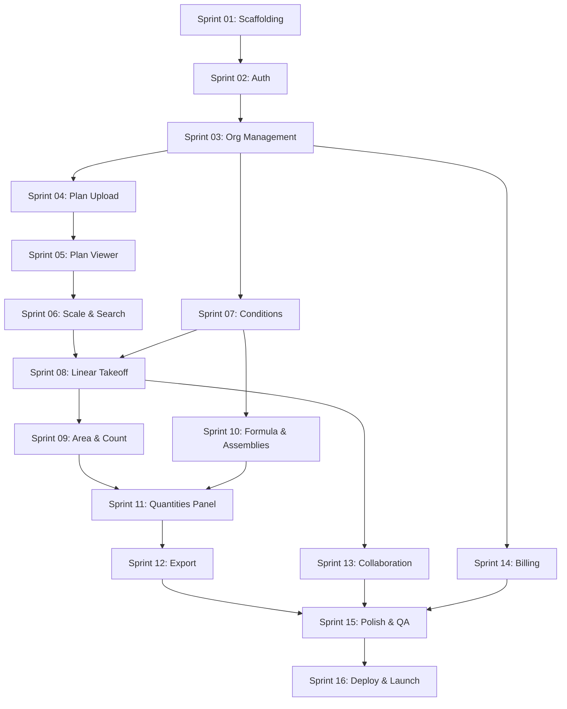

# Contruo MVP Roadmap

> **Sprint Duration:** 2 weeks each
> **Total Sprints:** 16
> **Estimated Timeline:** ~~32 weeks (~~7.5 months)
> **Methodology:** Agile sprints with deliverables at the end of each

---

## Phase 1: Foundation (Sprints 01-03, 6 weeks)

Build the platform foundation -- authentication, user management, and organization structure. At the end of this phase, users can sign up, create an org, invite team members, and manage roles.

| Sprint                    | Focus                   | Key Deliverable                                          |
| ------------------------- | ----------------------- | -------------------------------------------------------- |
| [Sprint 01](sprint-01.md) | Project scaffolding     | Repo, CI/CD, dev environment, Supabase connected         |
| [Sprint 02](sprint-02.md) | Auth & user management  | Signup, login, email verification, password reset        |
| [Sprint 03](sprint-03.md) | Organization management | Org creation, settings, invitations, roles & permissions |

---

## Phase 2: Plan Viewing (Sprints 04-06, 6 weeks)

Build the plan viewer -- the core canvas where all takeoff work happens. At the end of this phase, users can upload PDF plans, view them with full zoom/pan, navigate sheets, calibrate scale, and search text.

| Sprint                    | Focus                           | Key Deliverable                                  |
| ------------------------- | ------------------------------- | ------------------------------------------------ |
| [Sprint 04](sprint-04.md) | Plan upload & PDF processing    | Upload flow, async processing, sheet extraction  |
| [Sprint 05](sprint-05.md) | Plan viewer core                | PDF rendering, zoom/pan, sheet index, thumbnails |
| [Sprint 06](sprint-06.md) | Scale calibration & text search | Manual + auto scale, text search across sheets   |

---

## Phase 3: Takeoff Tools (Sprints 07-10, 8 weeks)

Build the measurement tools and the conditions/assemblies system. At the end of this phase, users can create conditions, draw linear/area/count measurements on plans, define assembly formulas, and see derived quantities.

| Sprint                    | Focus                       | Key Deliverable                                                  |
| ------------------------- | --------------------------- | ---------------------------------------------------------------- |
| [Sprint 07](sprint-07.md) | Conditions system           | Condition CRUD, properties, styling, condition manager UI        |
| [Sprint 08](sprint-08.md) | Linear takeoff              | Click-to-click drawing, running totals, segments, vertex editing |
| [Sprint 09](sprint-09.md) | Area & count takeoff        | Polygon/rect/circle areas, cutouts, rapid-click counting         |
| [Sprint 10](sprint-10.md) | Formula engine & assemblies | Expression parser, assembly items, derived quantities            |

---

## Phase 4: Data & Export (Sprints 11-12, 4 weeks)

Build the quantities panel and export functionality. At the end of this phase, users can review all measurements in a structured tree view with bidirectional plan linking, apply manual overrides, and export to PDF/Excel.

| Sprint                    | Focus            | Key Deliverable                                           |
| ------------------------- | ---------------- | --------------------------------------------------------- |
| [Sprint 11](sprint-11.md) | Quantities panel | Grouped tree, subtotals, bidirectional linking, overrides |
| [Sprint 12](sprint-12.md) | Export           | PDF/Excel generation, grouped layout, download flow       |

---

## Phase 5: Collaboration & Billing (Sprints 13-14, 4 weeks)

Add real-time collaboration and monetization. At the end of this phase, multiple users can work on the same plan simultaneously with live cursors, and the billing system handles subscriptions and seat management. **Sprint 13 (partial):** core Liveblocks flow is in app (auth, room, presence, avatars, cursors, measurement/condition sync events, presence-based locks); extended offline UX and comment DB groundwork remain. **Sprint 14 (partial / effectively MVP-complete):** Dodo checkout, webhooks, billing UI, seat proration and invite limits, subscription state guard (read-only / suspended / seat overage), team scheduled-seat warnings, and invoice receipt email to the owner are in place; optional follow-ons are Celery failure digests and explicit failure-notification email (see [sprint-14.md](sprint-14.md)).

| Sprint                    | Focus                   | Key Deliverable                                                |
| ------------------------- | ----------------------- | -------------------------------------------------------------- |
| [Sprint 13](sprint-13.md) | Real-time collaboration | Liveblocks auth + room, presence & avatars, cursors, broadcast sync, lock-on-select *(offline queue / comment schema: follow-on)* |
| [Sprint 14](sprint-14.md) | Billing & subscription  | Dodo checkout + webhooks, subscriptions/invoices + PDF links, billing dashboard, seat add/remove + proration, invite/seat enforcement, `subscription_guard` + banners, scheduled seat-drop warnings, seat-overage write limits, Resend invoice receipts to owner *(optional: Celery failure calendar, payment-failure email — [sprint-14.md](sprint-14.md))* |

---

## Phase 6: Launch Prep (Sprints 15-16, 4 weeks)

Polish, optimize, and prepare for production launch. At the end of this phase, Contruo is production-ready.

| Sprint                    | Focus                    | Key Deliverable                                                       |
| ------------------------- | ------------------------ | --------------------------------------------------------------------- |
| [Sprint 15](sprint-15.md) | Polish & QA              | Keyboard shortcuts, snap-to-geometry, freehand, edge cases, bug fixes |
| [Sprint 16](sprint-16.md) | Performance & deployment | Load testing, optimization, staging, production deploy, launch        |

---

## Sprint Status Tracker

| Sprint    | Status      | Start Date | End Date   | Notes                                                                                                                                                                                                                                             |
| --------- | ----------- | ---------- | ---------- | ------------------------------------------------------------------------------------------------------------------------------------------------------------------------------------------------------------------------------------------------- |
| Sprint 01 | Complete    | 2026-04-15 | 2026-04-15 | Scaffolding done, ready for Sprint 02                                                                                                                                                                                                             |
| Sprint 02 | Complete    | 2026-04-15 | 2026-04-15 | Auth flow, JWT validation, protected routes, welcome modal                                                                                                                                                                                        |
| Sprint 03 | Complete    | 2026-04-15 | 2026-04-15 | Org settings, team management, invitations, permissions, guest access                                                                                                                                                                             |
| Sprint 04 | Complete    | 2026-04-16 | 2026-04-16 | Projects, PDF upload + Supabase Storage, Celery PDF processing, sheet extraction & thumbnails, workspace UI                                                                                                                                       |
| Sprint 05 | Complete    | 2026-04-16 | 2026-04-16 | pdf.js viewer, zoom/pan, sheet index, 3-panel layout + persisted splits, document signed URL API                                                                                                                                                  |
| Sprint 06 | Complete    | 2026-04-16 | 2026-04-18 | Scale calibration (manual + auto), text search across sheets, takeoff toolbar                                                                                                                                                                     |
| Sprint 07 | Complete    | 2026-04-18 | 2026-04-18 | Conditions CRUD + RLS, manager panel, toolbar/status bar, measurements FK + cascade delete                                                                                                                                                        |
| Sprint 08 | Partial     | 2026-04-18 | 2026-04-18 | Linear takeoff core: measurements API, click-to-click draw, styled overlays, persistence, selection/delete, condition aggregates; vertex editing & on-canvas labels deferred — see [Deferred & follow-on features](#deferred--follow-on-features) |
| Sprint 09 | Partial     | 2026-04-18 | -          | Area poly/rect/ellipse, holes (H), aggregates, count rapid-click + drag PATCH + Ctrl multi-delete; area vertex edit & boolean subtract UI deferred — see [sprint-09.md](sprint-09.md)                                                             |
| Sprint 10 | Partial     | 2026-04-18 | -          | Formula engine (AST), assembly CRUD + RLS, derived quantities on measurements, org templates + import, condition reassignment UI; drag-reorder, formula syntax highlight, autocomplete deferred — see [sprint-10.md](sprint-10.md)                |
| Sprint 11 | Complete    | 2026-04-20 | 2026-04-20 | Quantities panel: tree, overrides, linking, virtualization (see sprint-11.md)                                                                                                                                                                     |
| Sprint 12 | Complete    | 2026-04-20 | 2026-04-20 | PDF/Excel export: Celery + Storage, toolbar + Ctrl+E, openpyxl + reportlab (see sprint-12.md)                                                                                                                                                     |
| Sprint 13 | Partial     | 2026-04-20 | -          | Liveblocks: `POST /api/v1/liveblocks/auth`, room `contruo:{org}:{project}`, presence, top-bar avatars + connection pill, PDF cursors, measurement/condition `broadcastEvent` + refetch, lock-on-select (outline + blocked actions). Deferred: offline queue & banner, canvas “edited by” tooltip, comment tables, full `event_log` audit if gaps — see [sprint-13.md](sprint-13.md) |
| Sprint 14 | Partial     | 2026-04-20 | -          | Billing: DodoPayments checkout + signed webhooks, `subscriptions`/`invoices`/RLS, billing settings UI, add-seat proration + remove-at-renewal, `NO_SEATS_AVAILABLE`, `enforce_org_subscription_state` (read-only / suspended / seat overage allowlist), `/auth/me` banners + Team scheduled-seat + overage UX, invoice PDF list, Resend receipt email to org owner on new payment. Deferred in sprint file: Celery 1/3/7-day retries, owner email on each payment failure — see [sprint-14.md](sprint-14.md) |
| Sprint 15 | Not Started | -          | -          |                                                                                                                                                                                                                                                   |
| Sprint 16 | Not Started | -          | -          |                                                                                                                                                                                                                                                   |

---

## Dependencies Between Sprints

---

## Feature-to-Sprint Mapping

| Feature File                                      | Sprint(s)                          |
| ------------------------------------------------- | ---------------------------------- |
| `features/platform/auth-and-onboarding.md`        | Sprint 02, 03                      |
| `features/platform/organization-management.md`    | Sprint 03                          |
| `features/collaboration/roles-and-permissions.md` | Sprint 03                          |
| `features/core/plan-viewer.md`                    | Sprint 04, 05, 06                  |
| `features/core/conditions-and-assemblies.md`      | Sprint 07, 10                      |
| `features/core/linear-takeoff.md`                 | Sprint 08, 15                      |
| `features/core/area-takeoff.md`                   | Sprint 09, 15                      |
| `features/core/count-takeoff.md`                  | Sprint 09                          |
| `features/core/quantity-management.md`            | Sprint 11                          |
| `features/export-reporting/export-formats.md`     | Sprint 12                          |
| `features/collaboration/real-time-editing.md`     | Sprint 13                          |
| `features/platform/subscription-and-billing.md`   | Sprint 14                          |
| `features/collaboration/comments-and-markup.md`   | Post-MVP (Sprint 13 groundwork deferred — schema not added yet) |
| `features/collaboration/activity-log.md`          | Post-MVP (groundwork in Sprint 01) |
| `features/core/volume-takeoff.md`                 | Post-MVP                           |

---

## Deferred & follow-on features

These items are **out of scope for the first vertical slice** of a sprint but are still part of the product vision. They are listed here so you can **pull them into a future sprint** without losing track of them. Suggested allocations reference this roadmap’s numbered sprints; you can also spin a **short follow-on** (e.g. “Sprint 08b”) between two planned sprints if needed.

### Linear takeoff — Phase 2 (extends [Sprint 08](sprint-08.md))

| Bucket              | Feature                                                                  | Suggested sprint                                                                                                  |
| ------------------- | ------------------------------------------------------------------------ | ----------------------------------------------------------------------------------------------------------------- |
| **Display (draft)** | Per-segment length labels on the plan while drawing                      | [Sprint 15](sprint-15.md) (polish & QA) or dedicated linear polish                                                |
| **Display (draft)** | Distance from last vertex to cursor (before next click)                  | [Sprint 15](sprint-15.md) or same polish pass as above                                                            |
| **Rendering**       | Inline measurement labels on completed runs (e.g. `47.5 LF`), zoom-aware | [Sprint 15](sprint-15.md) or linear Phase 2                                                                       |
| **Vertex editing**  | Handles, drag to move, midpoint to add vertex, Delete to remove vertex   | **Follow-on** before or inside [Sprint 15](sprint-15.md) — larger than a single bugfix; pairs with PATCH batching |
| **Persistence**     | Save edited geometry on commit / deselect (not every pointer frame)      | Same sprint as vertex editing                                                                                     |
| **History**         | Full undo/redo (including redo) for create, edit, delete                 | [Sprint 15](sprint-15.md) (keyboard & QA) or shared “measurement history” pass with area/count later              |

**Allocation tips**

- **Bundle A (annotation UX):** per-segment lengths + cursor distance + inline labels → one **polish** sprint, often **Sprint 15** alongside other shortcut/edge-case work.
- **Bundle B (editing):** vertex handles + PATCH-on-complete + live recalculation → treat as a **mini-milestone** (e.g. Sprint 08b or first week of Sprint 15) because it touches canvas, API, and conflict with pan/select.
- **Bundle C (history):** generalize undo/redo once linear + area tools share patterns — **Sprint 15** or **post–MVP** if time is tight.

### Backlog — other themes (placeholders)

| Theme            | Examples                                                 | When to pull in                                                           |
| ---------------- | -------------------------------------------------------- | ------------------------------------------------------------------------- |
| **Area & count** | Deferred items from [Sprint 09](sprint-09.md) when filed | After linear core is stable in production use                             |
| **Cross-tool**   | Shared snap, ortho mode, measurement templates           | [Sprint 15](sprint-15.md) or dedicated UX sprint                          |
| **Post-MVP**     | Volume takeoff, rich activity log, comments              | See [Feature-to-Sprint Mapping](#feature-to-sprint-mapping) Post-MVP rows |

### Settings — General tab (org logo, name, units)

The **General** settings route (`/settings`) and org fields (logo, name, default units) remain implemented for **future use** (e.g. read-only org branding for all roles, or full edit for admins). In the app shell today, **General tab navigation is commented out** and the sidebar **Settings** link points at **Team** (`/settings/team`) so most users land on team management first. When you re-enable General, uncomment the tab in `frontend/components/layout/settings-subnav.tsx` and point the sidebar back to `/settings` if desired.